# HTML/CSS-W3school+MDN+w3cplus

## 基础教程

> ##### [CSS现状和如何学习](https://w3cplus.medium.com/css%E7%8E%B0%E7%8A%B6%E5%92%8C%E5%A6%82%E4%BD%95%E5%AD%A6%E4%B9%A0-1ac786328761)
>
> ##### [CSS究竟是怎么工作的？](https://developer.mozilla.org/zh-CN/docs/Learn/CSS/First_steps/How_CSS_works#css究竟是怎么工作的？)

CSS称为 **层叠样式表，**即是 Cascade Style Sheets三个词的首字母缩写。每个字母代表的含义不同：

- **C（Cascade）：**指的是层叠，在CSS中编写样式规则是一个一个排列下来，可以简单的理解为先后顺序
- **S（Style）** : 第一个S，它指的是样式规则，比如 `body{color: red}`
- **S（Sheets）** ：第二个S，它指的是样式表，就是我们常说的 `.css` 文件，CSS的代码会放置在样式表里

前面提到过，Web页面至少由HTML、CSS和JavaScript三个部分构成，其中HTML会经过HTML Parser将HTML结构转换成[**DOM Tree**](https://www.w3cplus.com/javascript/dom-tree-and-traversals.html)；CSS会经过CSS Parser将CSS转换成[**CSSOM Tree**](https://www.w3cplus.com/javascript/cssom-css-typed-om.html)，正如下图所示：

DOM树和CSSOM树将会构建出渲染树：

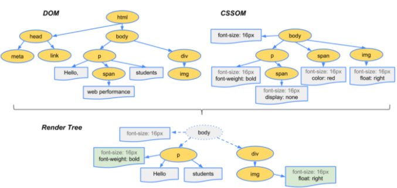

如果再把AOM（可访问树）引入起来的话，大致就像下图这样：

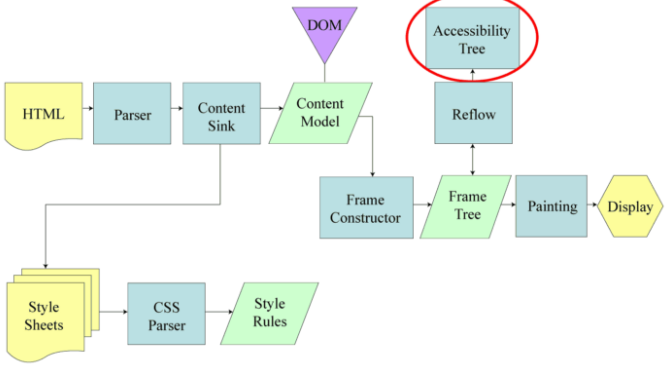

“CSS样式要和相应的HTML元素结合在一起使用，才能在浏览器渲染出来，呈现给用户”。

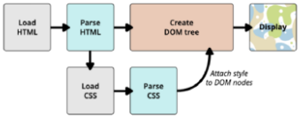

### CSS中的层叠：

- 文档流（Normal Flow）
- 格式化上下文（Formatting Context）
- 层叠上下文（Stacking Context）
- 层叠水平（Stacking Level）
- 层叠顺序（Stacking Order）

#### 文档流（Normal Flow）

- 很多时候她被称为Document Flow，但在CSS的标准被称为Normal Flow，即普通流或常规流。大家更喜欢称之为文档流。
- 除非文档的尺寸被CSS规则限定，否则浏览器垂直扩展文档来容纳全部的内容。每个新的块级元素渲染为新行。行内元素则按照顺序被水平渲染直到当前行遇到边界，然后换到下一行垂直渲染。
- 普通文档流中的盒子属于一种**格式化上下文（Formatting Context）**
  - **块格式化上下文（Block formatting context）**
  - **行内格式化上下文（Inline formatting context）**
  - 任何被渲染的HTML元素都是一个盒子（Box），这些盒子不是块盒子就是行内盒子。

格式化上下文对元素盒子做了一定的范围的限制，**普通流的过程：**

- 块级元素按照其在HTML源码中出现的顺序，在其容器盒子里从左上角开始，从上到下垂直地依次分配**空间层叠（Stack）**，并且独占一行，边界紧贴父盒子边缘。
- 两相邻元素间的距离由margin属性决定，在同一个块格式化上下文中的垂直边界将被**重叠（Collapse margins）**。
- 除非创建一个新的块格式化上下文，否则块级元素的宽度不受浮动元素的影响。
- 在对应的行内格式化上下文中，行内元素从容器的顶端开始，一个接一个地水平排列。

#### 格式化上下文（Formatting Context）

初始元素定义的环境
- 其主要包含两个要点，一个是 **元素定义的环境** ，另一个是 **初始化**。

我们使用[**CSS的** ](https://www.w3cplus.com/css/web-layout-css-display.html)`display`[ **属性**](https://www.w3cplus.com/css/web-layout-css-display.html)可以对元素进行格式化，即 **创建格式化上下文** 。

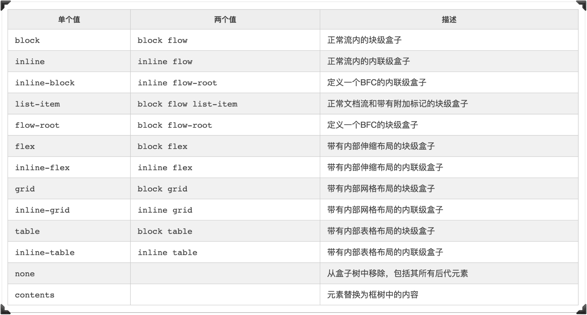

设置了 `display: contents` 会改变原有的格式，即`ul`子元素 `li` 都会变成网格项目。

#### 层叠上下文

平时我们从设备终端看到的HTML文档都是一个平面的，事实上HTML文档中的元素却是存在于三个维度中。除了大家熟悉的平面画布中的 `x` 轴和 `y` 轴，还有控制第三维度的`z`轴。

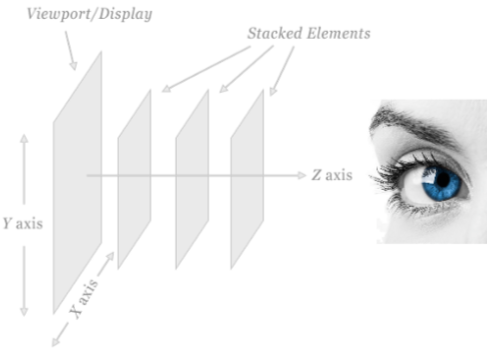

> 在DOM树中最先出现的元素被放在首位，之后出现的元素被放在前面的元素之上。但它并不总是那么简单。只有当页面上的所有元素是自然流才起作用。也就是说，当没有元素在流中的位置被改变或者已经脱离文档流，才起作用。

- 每个HTML元素都属于一个层叠上下文。
- 给定层叠上下文中的每个定位元素都具有一个整数的层叠层级，具有更大堆栈级别的元素盒子总是在具有较低堆栈级别的盒子的前面（上面）。
- 盒子可能具有负层叠级别。
- 层叠上下文中具有相同堆栈级别的框根据文档树出现的顺序层叠在一起。

文档中的层叠上下文由满足以下任意一个条件的元素形成：

- 根元素 (HTML)
- `z-index` 值不为 `auto` 的 `position` 值为非 `static` 。
- `position` 值为非 `static`
- 一个 `z-index` 值不为 `auto` 的 Flex 项目 (Flex item)，即：父元素 `display: flex|inline-flex`
- `opacity` 属性值小于 `1` 的元素
- `transform` 属性值不为 `none` 的元素
- `mix-blend-mode` 属性值不为 `normal` 的元素
- `filter` 、 `perspective` 、 `clip-path` 、 `mask` 、 `motion-path` 值不为 `none` 的元素
- `perspective` 值不为 `none` 的元素
- `isolation` 属性被设置为 `isolate` 的元素
- 在 `will-change` 中指定了任意 CSS 属性，即便你没有直接指定这些属性的值

每个页面都有一个默认的层叠上下文。这个层叠上下文的根就是 `html` 元素。 `html` 元素中的一切都被置于这个默认的层叠上下文的一个层叠层上。

#### 层叠水平（Stacking Level）

层叠水平（Stacking Level）决定了**同一个层叠上下文中**元素在z轴上的显示顺序。

普通元素的层叠水平优先由层叠上下文决定，因此，层叠水平的比较只有在当前层叠上下文元素中才有意义。

- **注意**：不要把**层叠水平**和CSS的 `z-index` 属性混为一谈。
  - 没错，某些情况下 `z-index` 确实可以影响层叠水平，但是，只限于定位元素以及Flex盒子的孩子元素；
  - 而层叠水平所有的元素都存在。

#### 层叠顺序（Natural Stacing Order）

在HTML文档中，默认情况之下有一个**自然层叠顺序（Natural Stacing Order）**，即元素在 `z` 轴上的顺序。它是由许多因素决定的。

比如下面这个列表，它显示了元素盒子放入层叠顺序上下文的顺序，从层叠的底部开始，共有七种层叠等级：

- 背景和边框：形成层叠上下文的元素的背景和边框。 层叠上下文中的最低等级。
- 负 `z-index` 值：层叠上下文内有着负 `z-index` 值的子元素。
- 块级盒：文档流中非行内非定位子元素。
- 浮动盒：非定位浮动元素。
- 行内盒：文档流中行内级别非定位子元素。
- `z-index: 0` ：定位元素。 这些元素形成了新的层叠上下文。
- 正 `z-index` 值：定位元素。 层叠上下文中的最高等级。

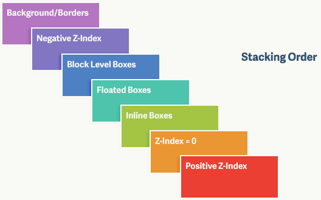

这七个层叠等级构成了层叠次序的规则。 

在层叠等级七上的元素会比在等级一至六上的元素显示地更上方（更靠近观察者）。 

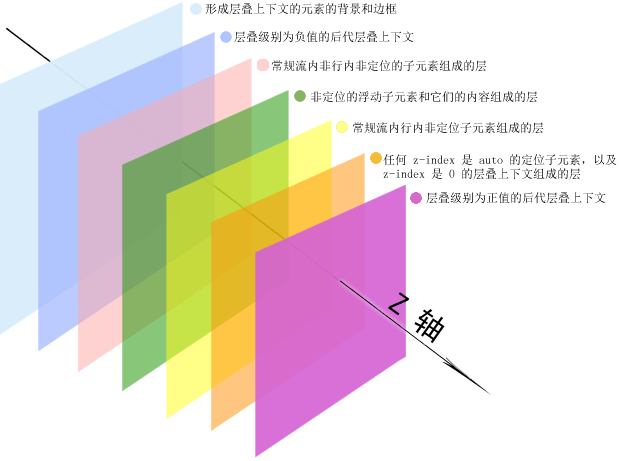

其实对于层叠顺序规则还是较为复杂的。

当页面包含浮动元素、绝对定位的元素、固定定位的元素或相对定位的元素（元素从正常位置偏移一定量）以及内联元素时，浏览器会以不同的方式显示它们（放置它们）。

元素从最靠近查看者的地方排列到最远的地方，如下所示：

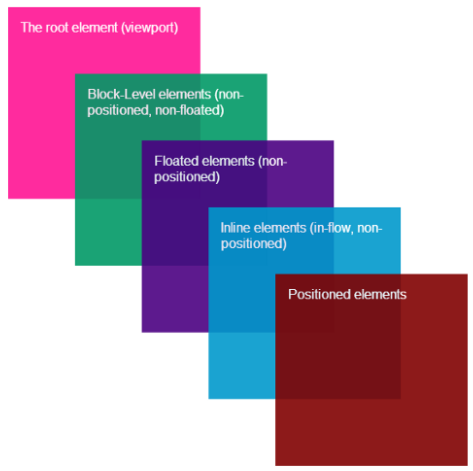

- 定位元素按源代码中的外观顺序排列。源代码中的最新内容最接近查看者
- 内联元素（比如文本和图像）是流入和非定位（它们的位置是静态的）
- 非浮动元素按照源代码中外观的顺序排列
- 非定位和非浮动块级元素
- 根元素 `html` 是全局层叠上下文的根，包含页面上的所有元素

这就是浏览器在呈现页面上的元素时应用的默认层叠顺序。

 **`z-index` 属性只适用于定位元素。**

具有除 `static` 之外的 `position` 值。

因此，如果所有定位的元素具有z-index的索引值，则将元素从最靠近查看者排列到最远的位置，如下所示：

具有正值的 `z-index` 的定位元素。较高的值更接近屏幕。然后，按照它们出现在源代码中的顺序排列：

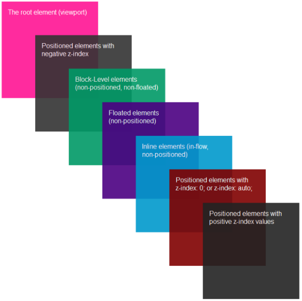

- 定位元素的 `z-index:0` 或 `z-index: auto` ;
- 内联元素（如文本和图像）是流中的和非定位的（它们的位置是静态的）
- 源代码中出现顺序的非定位浮动元素
- 非定位和非浮动块级元素
- 具有负值的 `z-index` 的定位元素。较低的 `z-index` 索引值更近。然后按照它们在源代码中出现的顺序
- 根元素 `html` 是全局层叠上下文的根，包含页面上的所有元素

当我们在定位元素上设置 `z-index` 值时，它指定该元素在它所属的**层叠顺序上下文**中的顺序，并且它将根据上述步骤在屏幕上渲染。

但是，当我们设置元素的 `z-index` 时会发生另一件事。获取除默认值 `auto` 之外的 `z-index` 值的元素实际上为其所有定位的后代元素创建层叠上下文。

- 一个具有值为 `z-index:auto` 的定位元素被视为创建了新的堆叠顺序上下文，但任何实际创建新层叠顺序上下文的定位后代和后代被视为父层叠顺序上下文的一部分，而不是新的层叠顺序上下文。

当一个元素成为一个新的层叠顺序上下文时，它所定位的后代元素将会按照我们前面提到的元素本身的规则在其中进行层叠渲染。因此，如果我们再次重写渲染过程，它会是这样的：

- 具有正值 `z-index` 的定位元素组成的层叠顺序上下文。
  - 较高的值更接近屏幕。
  - 然后按照它们在源代码中出现的顺序呈现
- 定位元素的 `z-index: 0` 或 `z-index: auto`
- 内联元素（比如文本和图像）是流中的和非定位的（它们的位置是静态的）
- 非浮动元素按照源代码中外观的顺序排列
- 非定位和非浮动块级元素
- 具有负值 `z-index` 的定位元素组成的层叠顺序上下文。
  - 较低的 `z-index` 的值更接近屏幕。
  - 然后按照它们在源代码中出现的顺序呈现
- 根元素 `html` 是全局层叠上下文的根，包含页面上所有元素

因此，当我们使用 `z-index` 属性来确定其层叠顺序中定位元素的顺序时，我们还创建了“原子（Atomic）”层叠顺序上下文，其中每个元素成为其所有定位后代的层叠顺序上下文。

#### 样式层叠

CSS在任何代码块中，比如 `{}` 中都可以同时书写相同的样式规则

甚至是我们在不同的样式文件中也可对同一元素使用相同的样式规则，比如

```css
/* base.css */
a {
    color: red
}

/* style.css */

@import base.css;

a {
    color: orange;
}

<!-- index.html -->

<link href="style.css" />
<style>
    a {
        color: lime;
    }
</style>
```

上面几种不同的样式写法，都可以被称为样式的层叠。

只不过最终被运用到元素上的规则以最终出现的规则为准，当然这也有一个前提条件，那就是他们选择器权重是相同。

### 权重

在CSS领域说到权重，或许大家更多关注到的是[**CSS选择器**](https://www.w3cplus.com/blog/tags/288.html)的权重。其实除了选择器权重对元素样式有影响之外，也和CSS样式规则出现的先后顺序有关（正如前面所提到的层叠顺序）。而且除了选择器有权重之外，也有属性权重一说。

对于选择器权重，下图可以很形象的阐述：

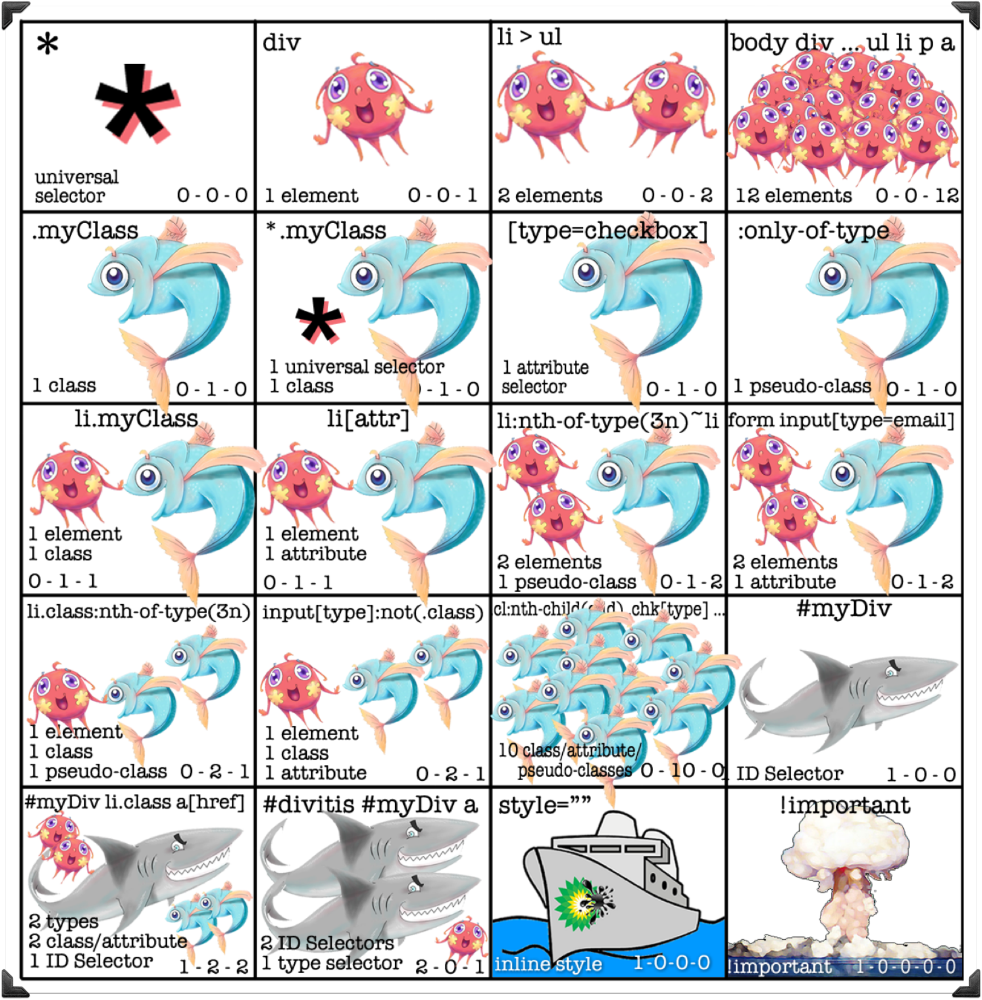

选择器权重可以类似于海洋世界中的生存规则，大鱼吃小鱼，小鱼吃虾米。如果你实现不清楚两个选择器的权重，也可以[**使用在线的测试工具来检测**](https://specificity.keegan.st/)

于一个选择器的权重，将会按下面这样的规则进行计算：

- 如果声明来自一个行内样式（ `style` 属性）而不是一条选择器样式规则，算 `1` ，否则就是 `0` （ `=a` ）。HTML中，一个元素的 `style` 属性值是样式规则，这些属性没有选择器，所以 `a=1` , `b = 0` , `c = 0` , `d = 0` ，即 `1, 0, 0, 0`
- 计算选择器中 `ID` 属性的数量 ( `= b` )
- 计算选择器中其它属性和伪类的数量 ( `= c` )
- 计算选择器中元素名和伪元素的数量 ( `= d` )

4个数连起来 `a-b-c-d` （在一个基数很大的数字系统中）表示特殊性，比如下面这样的示例：

```css
*             {}  /* a=0 b=0 c=0 d=0 -> 选择器权重 = 0,0,0,0 */
li            {}  /* a=0 b=0 c=0 d=1 -> 选择器权重 = 0,0,0,1 */
li:first-line {}  /* a=0 b=0 c=0 d=2 -> 选择器权重 = 0,0,0,2 */
ul li         {}  /* a=0 b=0 c=0 d=2 -> 选择器权重 = 0,0,0,2 */
ul ol+li      {}  /* a=0 b=0 c=0 d=3 -> 选择器权重 = 0,0,0,3 */
h1 + *[rel=up]{}  /* a=0 b=0 c=1 d=1 -> 选择器权重 = 0,0,1,1 */
ul ol li.red  {}  /* a=0 b=0 c=1 d=3 -> 选择器权重 = 0,0,1,3 */
li.red.level  {}  /* a=0 b=0 c=2 d=1 -> 选择器权重 = 0,0,2,1 */
#x34y         {}  /* a=0 b=1 c=0 d=0 -> 选择器权重 = 0,1,0,0 */
style=""          /* a=1 b=0 c=0 d=0 -> 选择器权重 = 1,0,0,0 */
```

客户端渲染页面时，除了选择器权重会影响元素样式规则之外，还有样式来源也会影响元素样式规则。就CSS规则的来源而言，规则主要来自三个地方：

- **编写者规则（Author）** ：这是HTML文档声明的CSS。也就是我们前端开发人员编写的，根据文档语言（比如HTML）约定给源文档指定样式表。这也是我们能够控制的唯一来源
- **用户（User）** ：这是由浏览器的用户定义和控制的。不是每个人都会有一个，但是当人们添加一个时，通常是为了覆盖样式和增加网站的可访问性。比如，用户可以指定一个售有样式表的文件，或者用户代理可能会提供一个用来生成用户样式（或者表现得像这样做了一样）的界面
- **用户代理（User-Agent）** ：这些是浏览器为元素提供的默认样式。这就是为什么 `input` 在不同的浏览器上看起来略有不同，这也是人们喜欢使用CSS重置样式，以确保重写用户代理样式的原因之一

这三种样式表将在一定范围内重叠，并且它们按照层叠互相影响。

CSS中运用于同一元素时的属性也会有权重一说，比如说同样用来描述元素宽度的属性 `width` 、 `min-width` 、 `max-width` ，比如：

```css
.block {
  display: inline-block;
  min-width: 50%;
  max-width: 100%; /* winner */
  width: calc((480px - 100%) * 480);
  border: 1px solid #000;
}
```

不过同时在同一个元素上使用了这三个属性时，他们的权重大致如下：

- 当 `width` 大于 `min-width` 时，会取 `width` 的值；当 `width` 小于 `min-width` 时，会取 `min-width` 的值
- 当 `width` 大于 `max-width` 时，会取 `max-width` 的值；当 `width` 小于 `max-width` 时，会取 `width` 的值
- 如果`min-width`大于`max-width`，那么`min-width`值将作为元素的宽度；如果`min-width`小于`max-width`，那么`min-width`值将作为元素的宽度

有关于这方面更详细的介绍可以阅读《[图解CSS: 元素尺寸的设置](https://www.w3cplus.com/css/css-intrinsic-and-extrinsic-sizing.html)》一文。


如果你[使用Flexbox来构建Web的布局](https://www.w3cplus.com/blog/tags/157.html)，那么对于Flex项目的宽度也有一定的权重规则：

> 首先根据 `content` ➜ `width` ➜ `flex-basis` 来决定用哪个来决定用于Flex项目。如果Flex项目显式设置了 `flex-basis` 属性，则会忽略 `content` 和 `width` 。而且 `min-width` 是用来设置Flex项目的下限值； `max-width` 是用来设置Flex项目的上限值。

即：

- `flex-basis` 大于 `max-width` ，Flex项目的宽度等于 `max-width` ，即 `max-width` 能覆盖 `flex-basis`
- 如果 `flex-basis` 小于 `min-width` 时，Flex项目的宽度会取值 `min-width` ，即 `min-width` 覆盖 `flex-basis`

由于 `min-width` 大于 `max-width` 时会取 `min-width` ，有了这个先取条件我们就可以将 `flex-basis` 和 `min-width` 做权重比较，即： `flex-basis` 会取于 `min-width` 。反过来，如果 `min-width` 小于 `max-width` 时则依旧会取 `max-width` ，同时要是 `flex-basis` 大于 `max-width` 就会取 `max-width` 。

注意，Flexbox布局中有关于Flex项目的宽度计算是非常复杂的，如果你对这方面知识感兴趣的话，可以阅读《[你真的了解CSS的 ](https://www.w3cplus.com/css/the-difference-between-width-and-flex-basis.html)`flex-basis`[ 吗？](https://www.w3cplus.com/css/the-difference-between-width-and-flex-basis.html)》一文。

### 继承

在W3C规范中，描述每个CSS属性时都会有一个选项是“Inherited”，如果值为“no”表示该属性是不可继承的。

处理属性的继承：属性值是 `initial` 、 `inherit` 、 `unset` 和 `revert` 、 `all` 。

详细的介绍可以阅读《[图解CSS：CSS层叠和继承](https://www.w3cplus.com/css/Illustrated-CSS-details-and-cases-chr2-cascade-and-inherit.html)》一文。

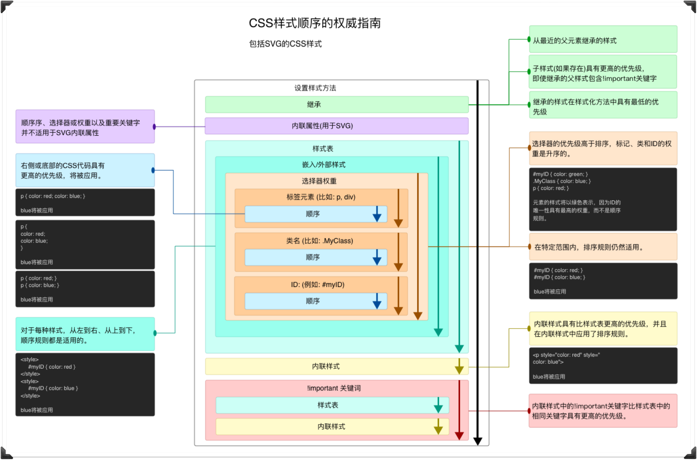

建议大家抽空阅读下面这几篇文章：

- [聊聊CSS中的层叠相关概念](https://www.w3cplus.com/css/understand-css-stacking-context-order-z-index.html)
- [CSS定位和层叠控制](https://www.w3cplus.com/css/css-position-and-z-index.html)
- [CSS层叠和继承](https://www.w3cplus.com/css/Illustrated-CSS-details-and-cases-chr2-cascade-and-inherit.html)
- [管理CSS层叠](https://www.w3cplus.com/css3/managing-the-css-cascade.html)
- `display`[ 属性](https://www.w3cplus.com/css/web-layout-css-display.html)

### 视觉格式化模型

> 视觉格式化模型和CSS盒模型不是同一个东西！

Web页面（文档树）是由很一个个盒子组成（因为任何元素都可以被视为是一个盒子），而视觉格式化模型却是一套规则，用来计算元素转换为盒子的规则。

而页面的布局都由这些盒子的所处的各处位置组合而成。

那么理解了元素怎么转成盒子的规则，就理解了Web页面是怎么布局。

而每个盒子的布局主要由以下几个因素决定：

- **盒子的尺寸** ：精确指定、由约束条件指定或没有指定
- **盒子的类型** ：行内盒子（inline）、行内级盒子（inline-level）、原子行内级盒子（atomic inline-level）和块盒子（block）
- **定位方案** ：普通流定位、浮动定位或绝对定位
- **文档树中的其它元素** ：即当前盒子的子元素或兄弟元素
- **视窗尺寸与位置**
- **所包含的图片的尺寸**
- **其他的某些外部因素**

如果你想彻底理解CSS的视觉可式化模型，其中还有一些概念需要掌握，比如：

- **块（Block）** ：一个抽象的概念，一个块在文档流上占据一个独立的区域，块与块之间在垂直方向按照顺序依次堆叠（默认情况之下）
- **包含块（Containing Block）** ：指的是包含其他盒子的块
- **盒子（Box）** : 一个抽象的概念，由CSS引擎根据文档中的内容所创建，主要用于文档元素的定位、布局和格式化等用途
- **块级盒子（Block-level Box）**：由块级元素生成。一个块级元素至少会生成一个块级盒子，但也有可能生成多个（例如列表项元素）
- **行内级盒子（Inline-level Box）**：由行内级元素生成。同样的，一个行内元素至少会生成一个行内级盒子。行内级盒子包括行内盒子和原子行内级盒子两种，区别在于该盒子是否参与行内格式化上下文的创建
- **块盒子（Block Box）** :如果一个块级盒子同时也是一个块容器盒子，则称其为块盒子。除具名块盒子之外，还有一类块盒子是匿名的，称为匿名块盒子（Anonymous Block Box），匿名盒子无法被CSS选择器选中
- **原子行内级盒子（Atomic Inline-level Box）** ：不参与行内格式化上下文创建的行内级盒子。原子行内级盒子一开始叫做原子行内盒子（Atomic Inline Box），后被修正。原子内级盒子的内容不会拆分成多行显示。
- **行盒（Line Box）** : 和行内盒是不一样的。行盒是由行内格式化上下文（Inline Formatting Context）产生的盒子，用于表示一行。行盒从包含块的一边排版到另一边。一般情况下，浏览器为会每行创建一个看不见的行盒
- **块容器盒子（Block Container Box或Block Containning Box）** ：块容器盒子侧重于当前盒子作为容器角色，它不参与当前块的布局和定位，它所描述的仅仅是当前盒子与其后代之间的关系
- **块级元素（Block-level Element）** : 是指元素的 `display` 值为 `block` 、 `list-item` 、 `table` 、 `flex` 和 `grid` 等，该元素将成为块级元素。元素是否是块级元素仅是元素本身的属性，并不直接用于格式化上下文的创建或布局
- **行内级元素（Inline-level Element）** ：是指元素的 `display` 值为 `inline` 、 `inline-block` 、 `inline-table` 、 `inline-flex` 和 `inline-grid` 等，该元素将成为行内级元素。与块元素一样，元素是否是行内级元素仅是元素本身的属性，并不直接用于格式化上下文的创建或布局
- **视窗（Viewport）** ：视窗就是浏览器中可视区域。视窗大小指的就是浏览器可视区域的大小
- **匿名盒子** : 分为块匿名盒子和行内匿名盒子。在某些情况下进行视觉格式化时，需要添加一些增补性的盒子，这些盒子无法被CSS的选择器选中，而这种盒子被称为匿名盒子（Anonymous Box）。

除了上述说到的盒子，在CSS中还定义了几种内容模型，这些模型同样可以应用于元素。这些模型一般用来描述布局，它们可能会定义一些额外的盒子类型：

- **表格内容模型** ：可能会创建一个表格包装器盒子和一个表格盒子，以及多个其他盒子如表格标题盒子等
- **多列内容模型** ：可能会在容器盒子和内容之间创建多个列盒子
- **Flexbox内容模型** ：可能会创建一个弹性盒子
- **Grid内容模型** ：可能会创建一个网格盒子

就这些概念也足让我们感到烦人了吧。我想你看到这些概念，应该不会再说CSS容易了。

有了这些概念，我们再来说CSS中的格式化上下文。我想你或多或少听过这个词吧。在CSS中，格式化上下文有很多种，除了大家熟悉的 **BFC** 、 **IFC** 之外还有由Flexbox布局创建的 **FFC** 和Grid布局创建 **GFC** 等。这些统称为CSS **格式化上下文** ，也被称作 **视觉格式化模型** 。而CSS视觉格式化模型是用来处理文档并将它显示在视觉媒体上的机制。

简单地说， **就是用来控制盒子的位置，即实现页面的布局** 。

格式化上下文也可以说是CSS视觉渲染中的一部分， **其主要作用是决定盒子模型的布局，其子元素将如何定位以及和其他元素的关系和相互作用** 。那么理解CSS格式化上下文有助于我们掌握各类CSS布局的关键。

#### 行内格式化上下文

行内格式化上下文（Inline Formatting Context），简称 **IFC** 。主要用来规则行内级盒子的格式化规则。

IFC的行盒的高度是根据包含行内元素中最高的实际高度计算而来。主要会涉及到CSS中的 `font-size` 、 `line-height` 、 `vertical-align` 和 `text-align` 等属性。

行内元素从包含块顶端水平方向上逐一排列，水平方向上的 `margin` 、 `border` 、 `padding` 生效。行内元素在垂直方向上可按照顶部、底部或基线对其。

当几个行内元素不能在一个单独的行盒中水平放置时，他们会被分配给两个或更多的(Vertically-stacked Line Box)垂直栈上的行盒，因此，一个段落是很多行盒的垂直栈。这些行盒不会在垂直方向上被分离（除非在其他地方有特殊规定），并且他们也不重叠。

- 垂直方向上，当行内元素的高度比行盒要低，那么 `vertical-align` 属性决定垂直方向上的对齐方式。
- 水平方向上，当行内元素的总宽度比行盒要小，那么行内元素在水平方向上的分部由 `text-align` 决定。
- 水平方向上，当行内元素的总宽度超过了行盒，那么行内元素会被分配到多个行盒中去，如果设置了不可折行等属性，那么行内元素会溢出行盒。
- 行盒的左右两边都会触碰到包含块，而 `float`[ 元素](https://www.w3cplus.com/blog/tags/83.html)则会被放置在行盒和包含快边缘的中间位置。

下面这些规则都会创建一个行内格式化上下文：

- IFC只有在一个块级元素中仅包含行内级元素时才会生成
- 内部的盒子会在不平方向，一个接一个的放置
- 这些盒子垂直方向的起点从包含块盒子的顶部开始
- 摆放这些盒子的时候，它们在水平方向上的 `padding` 、 `border` 和 `margin` 所占用的空间都会被考虑在内
- 在垂直方向上，这些盒子可能会以不同形式来对齐（ `vertical-align` ）
- 能把在一行上的盒子都完全包含在一行行盒（Line Box），行盒的宽度是由包含块和存在的浮动来决定
- IFC中的行盒一般左右边都紧贴其包含块，但是会因浮动元素的存在发生变化。浮动元素会位于IFC与行盒之间，使得行盒宽度缩短
- 当行内级盒的总宽度小于包含它们的行盒时，其水平渲染规则则由 `text-align` 来确定
- 当行内盒超过行盒的宽度时，它会被分割成多个盒子，这些盒子被分布在多个行盒里。如果一个行内盒不能被分割，则会溢出行盒

IFC主要用于：

- 行内元素按照 `text-align` 进行水平居中
- 行内元素撑开父元素高度，通过 `vertical-align` 属性进行垂直居中

#### 块格式化上下文

块格式化上下文（Block Formatting Context，BFC） 是Web页面的可视化CSS渲染的一部分，是块盒子的布局过程发生的区域，也是浮动元素与其他元素交互的区域。

BFC实际上就是页面中一块渲染区域，该区域与其他区域隔离开来。容器里面子元素不会影响到外部，外部的元素也不会影响到容器里的子元素。

BFC 内部的盒子会从上至下一个接着一个顺序排列。BFC 内的垂直方向的盒子距离以 `margin` 属性为准，上下 `margin` 会叠加。每个元素的左侧最外层边界与包含块 BFC 的左边相接触(对于从左往右的格式化，否则相反)。即使存在浮动也是如此。BFC 的区域不会与浮动元素的盒子折叠。BFC 的高度也会受到浮动元素的影响，浮动元素参与计算。

**下面这些规则可以创建一个BFC：**

- 根元素或包含根元素的元素
- 浮动元素（元素的 `float` 不是 `none` ）
- 绝对定位元素（元素的 `position` 为 `absolute` 或 `fixed` ）
- 行内块元素（元素的 `display` 为 `inline-block` ）
- 表格单元格（元素的 `display` 为 `table-cell` ，HTML表格单元格默认为该值）
- 表格标题（元素的 `display` 为 `table-caption` ，HTML表格标题默认为该值）
- 匿名表格单元格元素（元素的 `display` 为 `table` 、 `table-row` 、 `table-row-group` 、 `table-header-group` 、 `table-footer-group` （分别是HTML `table` 、 `row` 、 `tbody` 、 `thead` 、 `tfoot` 的默认属性）或 `inline-table` ）
- `overflow` 值不为 `visible` 的块元素
- `display` 值为 `flow-root` 的元素
- `contain` 值为 `layout` 、 `content` 或 `strict` 的元素
- 弹性元素（ `display` 为 `flex` 或 `inline-flex` 元素的直接子元素）
- 网格元素（ `display` 为 `grid` 或 `inline-grid` 元素的直接子元素）
- 多列容器（元素的 `column-count` 或 `column-width` 不为 `auto` ，包括 `column-count` 为 `1` ）
- `column-span` 为 `all` 的元素始终会创建一个新的BFC，即使该元素没有包裹在一个多列容器中

**块格式化上下文包含创建它的元素内部的所有内容。其主要使用：**

- 创建独立的渲染环境
- 防止因浮动导致的高度塌陷
- 防止上下相邻的外边距折叠

#### Flex格式化上下文

Flex格式化上下文（Flexbox Formatting Context）俗称 **FFC** 。当 `display` 取值为 `flex` 或 `inline-flex` ，将会创建一个Flexbox容器。该容器为其内容创建一个新的格式化上下文，即Flex格式化上下文。

不过要注意的是，Flexbox容器不是块容器（块级盒子），下列适用于块布局的属性并不适用于Flexbox布局：

- 多列中的 `column-*` 属性不适用于Flexbox容器
- `float` 和 `clear` 属性作用于Flex项目上将无效，也不会把让Flex项目脱离文档流
- `vertical-algin` 属性作用于Flex项目上将无效
- `::first-line` 和 `::first-letter` 伪元素不适用于Flexbox容器，而且Flexbox容器不为他们的祖先提供第一个格式化的行或第一个字母

#### Grid格式化上下文

Grid格式化上下文（Grid Formaatting Context），俗称 **GFC** 。和FFC有点类似，元素的 `display` 值为 `grid` 或 `inline-grid` 时，将会创建一个Grid容器。该完完全全器为其内容创建一个新的格式化上下文，即Grid格式化上下文。这和创建BFC是一样的，只是使用了网格布局而不是块布局。

网格容器不是块容器，因此一些假定为块布局设计的属性并不适用于网格格式化上下文中。特别是：

- `float` 和 `clear` 运用于网格项目将不会生效。但是 `float` 属性仍然影响网格完完全全器子元素上 `display` 的计算值，因为这发生在确定网格项目之前
- `vertical-align` 运用于网格项目也将不会生效
- `::first-line` 和 `::first-letter` 伪元素不适用于网格容器，而且网格容器不向它们社先提供第一个格式化行或第一个格式化字母

对于视觉格式化模型更详细的介绍可以阅读《[Web布局：视觉格式化模型](https://www.w3cplus.com/css/web-layout-visual-formatting-model.html)》一文。

### 盒模型

在CSS世界中，会何一个HTML元素可以解析成一个盒子。可以通过CSS属性（物理属性）来决定盒子的大小。而决定盒子大小主要由四个属性来决定：

- **Content** ：元素中的文本、图像或其他媒体内容
- **padding** ：盒子内容格边框之间的空间
- **border** ：盒子的边框
- **margin** ：盒子与其他盒子之间的距离

在浏览器调试器中“Computed”可以看到它是怎么来解释一个元素的盒模型。

但在布局中，盒子的宽度计算会直接影响到布局，甚至会直接打破页面的布局。比如说，一个 `div` 元素：

```
div { 
  width: 100%; 
  padding: 1rem; 
}
```

会让 `div` 超出容器，面对这样的场景时，就需要借助[CSS的 ](https://www.w3cplus.com/content/css3-box-sizing)`box-sizing`[ 属性](https://www.w3cplus.com/content/css3-box-sizing)，它可以更好的帮助我们控制盒子的大小：

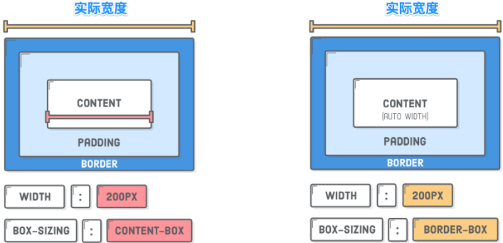

用个实例来解释，这样更易于理解：

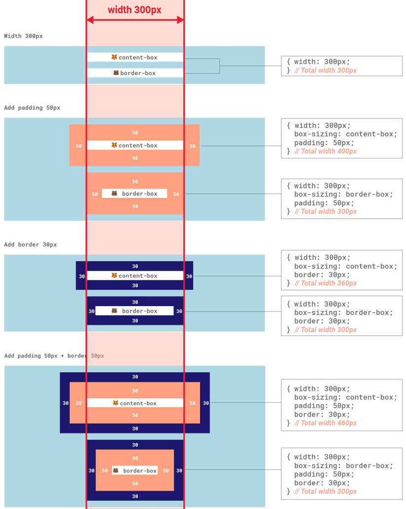

大家是否有留意到，在前面提到的 `padding` 、 `border` 和 `margin` 等都是采用的物理特性来描述一个盒子，而且开发者讨论盒模型的时候，都习惯使用下图来阐述它：

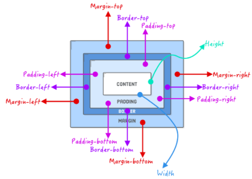

但随着[CSS的逻辑属性的出现](https://www.w3cplus.com/css/css-logical-properties.html)，在CSS中就除我们所熟悉的物理属性之外，还新增了很多逻辑属性:

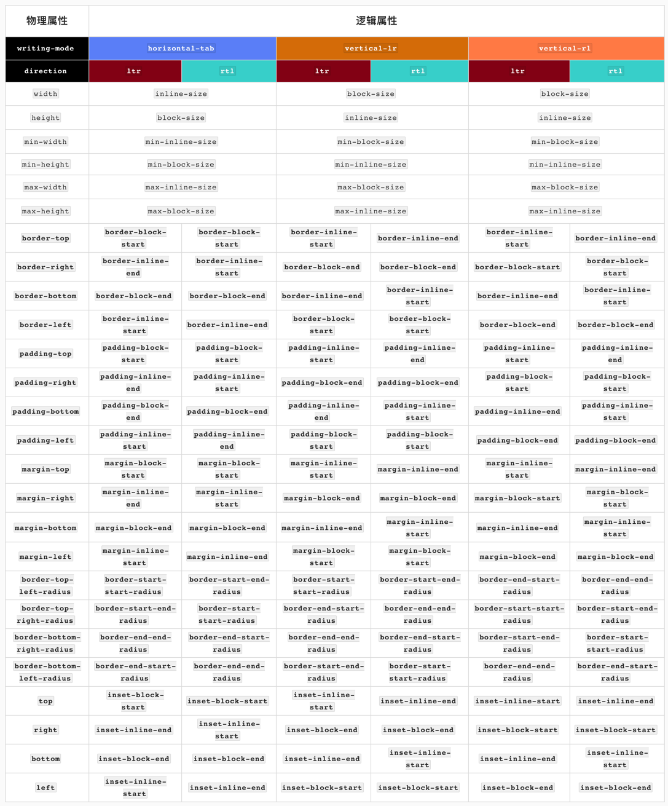

同时[逻辑属性对于CSS盒模型也将带来相应的变化](https://www.w3cplus.com/css/new-box-model-width-logical-properties.html)：

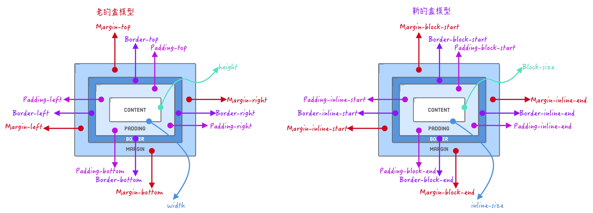

如果你在布局时，使用逻辑属性来替代物理属性，对于一些国际网站，比如阿拉伯语的网站，有着明显的作用。[在改变书写模式时](https://www.w3cplus.com/css/css-writing-modes.html)，不需要额外调整布局相关的属性：

这个我在《[Web中向左向右](https://www.w3cplus.com/css/ltr-and-rtl-in-css.html)》一文中有做过详细的阐述。

有关于CSS盒模型更详细的介绍还可以阅读：

- [Web布局： CSS 盒模型](https://www.w3cplus.com/css/web-layout-box-module.html)
- [图解CSS：CSS逻辑属性](https://www.w3cplus.com/css/css-logical-properties.html)
- [CSS的逻辑属性对盒模型带来的变化](https://www.w3cplus.com/css/new-box-model-width-logical-properties.html)

### 布局

[**Web布局**](https://www.w3cplus.com/blog/tags/695.html)对于Web前端开发者而言，它就是一个永恒的话题。

在Web布局整个演进过程当中，经历了没有**任何布局**、**表格布局**、[**定位布局**](https://www.w3cplus.com/blog/tags/152.html)、[**浮动布局**](https://www.w3cplus.com/blog/tags/83.html)、[**Flexbox布局**](https://www.w3cplus.com/blog/tags/157.html)等布局模式。除了这些我们常看到的布局之外，即将还会有[**Grid**](https://www.w3cplus.com/blog/tags/356.html)、[**Shapes**](https://www.w3cplus.com/blog/tags/418.html)（类似杂志不规则布局）和[**多列布局**](https://www.w3cplus.com/blog/tags/86.html)（类似报纸排版布局）等现代布局模式。这些布局模式从侧面也反映出其自身是Web演进过程中的一种产物，都承载了自己在当时那个时期的史命。

对于Web前端开发人员而言面对Web的布局始终跟着网页的设计在走。而网页的设计在不同的时期也在不断的发生变化：从最初的站点到现在流行的站点在设计的发展有三个阶段：

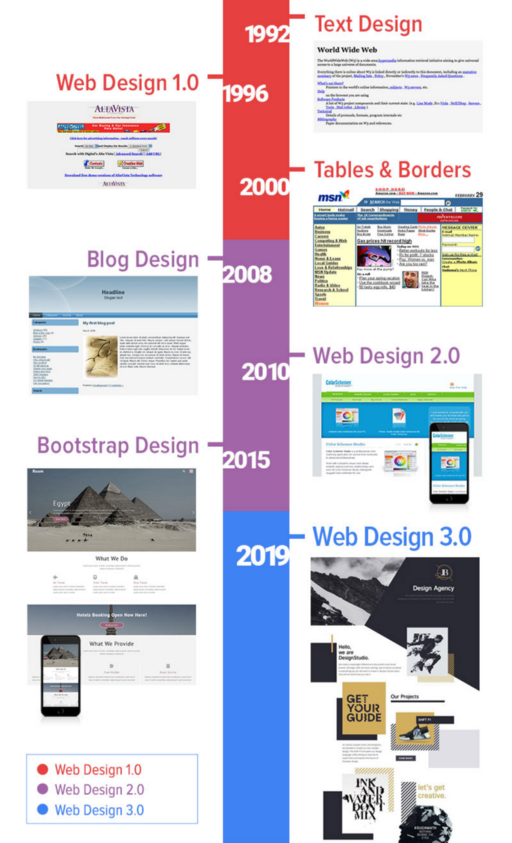

不同是代的的设计情景之下，Web的元素的定位也有其演变过程：

- Web设计1.0是“一维的”：设计元素大多是按顺序排列的（按文档流的自然顺序排列）
- Web设计2.0是“二维的”：单元格中有放置元素的网格，具有更多的自由性
- Web设计3.0是一个“新的维度”：它可以像平面设计工具一样的自由地定位元素、重叠。为网页设计开辟了新的前景。也将开启新的Web页面设计时代

在社区中只针对移动端的适配方案的讨论也非常地多，比如Flexible布局，VW布局等，如果你单独对移动端适配感兴趣的话，还可以阅读下面几篇文章：

- [使用Flexible实现手淘H5页面的终端适配](https://www.w3cplus.com/mobile/lib-flexible-for-html5-layout.html)
- [再聊移动端页面的适配](https://www.w3cplus.com/css/vw-for-layout.html)
- [iPhone X的缺口和CSS](https://www.w3cplus.com/css/the-notch-and-css.html)
- [iPhone X的Web设计](https://www.w3cplus.com/mobile/designing-websites-for-iphone-x.html)
- [如何在Vue项目中使用vw实现移动端适配](https://www.w3cplus.com/mobile/vw-layout-in-vue.html)
- [移动端上的设计和适配](https://www.w3cplus.com/mobile/mobile-design-and-adapter.html)
- [手淘Web页面Bar和纵向适配的设计](https://www.w3cplus.com/mobile/taobao-bar-design.html)

但这并没有终止Web布局的讨论。或许你不久就需要面对折叠设备或多屏设备的布局适配。

### 写CSS的姿势

正因为CSS的层叠、权重、继承等因素，很多开发者在编写CSS的时候总是会碰到选择器冲突、样式覆盖、代码冗余等种种问题。为此，社区中有很多种关于书写或者说[维护CSS的方法论](https://2020.stateofcss.com/en-US/technologies/methodologies/)，比如：BEM、ITCSS、Utility-first CSS（Atomic CSS (Utilit））、SMACSS、OOCSS、CUBE CSS

也有很多相关的[CSS框架（CSS Frameworks）](https://2020.stateofcss.com/en-US/technologies/css-frameworks/)来帮助大家快速编写CSS，构建项目：

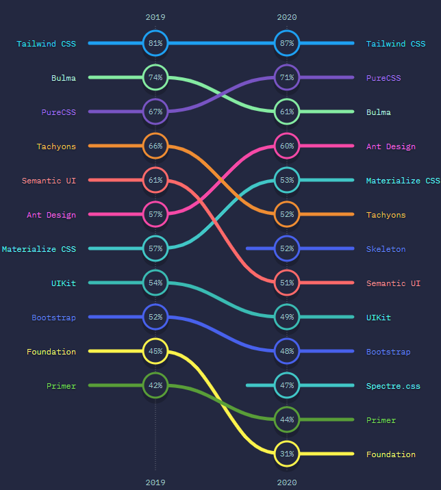

特别是这两年，社区讨论比较多的是[**Utility-first CSS**](https://frontstuff.io/in-defense-of-utility-first-css)，而这方面的代表框架就是[**Tailwind CSS**](https://tailwindcss.com/)：

现在我喜欢的是[**Utility-first CSS**](https://frontstuff.io/in-defense-of-utility-first-css)**是**[**Tailwind CSS**](https://tailwindcss.com/)。

除了CSS的方法论和框架，为了提高大家的编码效率和维护项目的CSS，社区中还有很多[**CSS方面的处理器**](https://2020.stateofcss.com/en-US/technologies/pre-post-processors/)：

很多时候，Sass、Stylus和LESS常被称为预处理器，PostCSS常被称为后处理器，他们可以说是一前一后。他们之间的关系如下图所示：

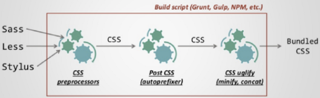

不过，随着React和Vue这样的框架出来之后，社区中出现另一种声音，那就是在[**JavaScript中编写CSS（即：CSS-in-JS）**](https://2020.stateofcss.com/en-US/technologies/css-in-js/):

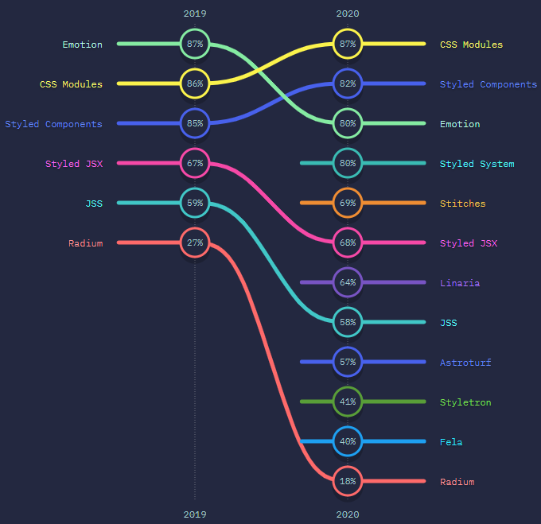

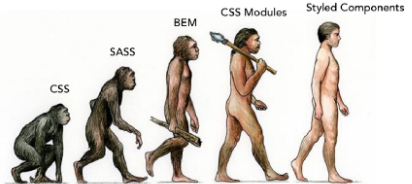

不过，不管怎么变，我们在编写CSS时，都可以像《[写CSS的姿势](https://www.w3cplus.com/css/css-evolution.html)》文章末尾提到的流程图，大家根据自己和自己的团队找到最为适合的方式。因为没有最好，只有最合适：

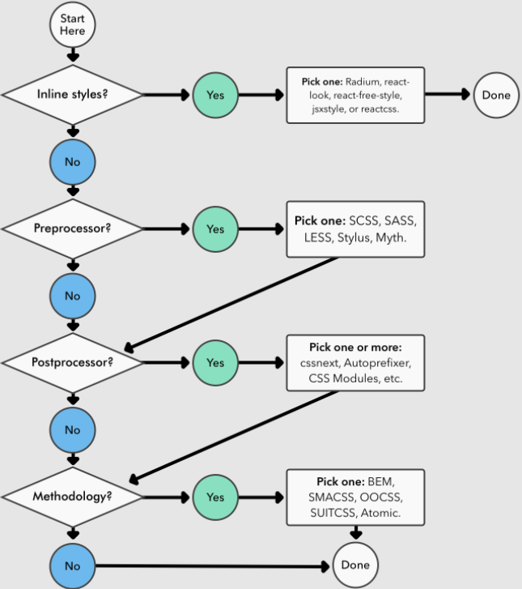

有一点年纪的CSSer（或者说Web开发者）对于[**CSS禅意花园**](http://www.csszengarden.com/)应该不会感到陌生。CSS禅意花园有一个最大的特色，那就是基于同一套HTML的结构，可以实现不同的Web UI效果，即，有着不同的布局风格

另外一个和CSS禅意花园相似的就是 @[Stephanie Eckles](https://twitter.com/5t3ph) 推出的 [**Style Stage**](https://stylestage.dev/styles/)**，也可以基于同一HTML结构，实现不同的UI效果**，我把她称为现代版的CSS禅意花园，现代版的CSS设计之美。

我把她称之为[**CSS的视觉之美**](https://www.w3cplus.com/css/css-visual-effects.html)。

使用CSS的 `**border**` 、 `**box-shadow**` 、 `**border-radius**` 、[**渐变**](https://www.w3cplus.com/blog/tags/658.html)、 `**clip-path**` 、 `**transform**` 和 `**mask**` 等属性可以直接用来绘制不同的视觉效果，甚至实现一些复杂的UI，还可以结合CSS的 `**transition**` 和 `**animation**` 实现带有微动效的UI场景。

想象一下，[使用一个 ](https://a.singlediv.com/)`div`[ 绘制不同的UI效果](https://a.singlediv.com/)，你可能看到效果，会觉得不可思议吧：

更不可思议的是，[使用CSS还可以绘画](https://css-art.com/)：

除此之外，近几年CSS发展也特别的快，推出很多新特性。比如[@argyleink](https://twitter.com/argyleink)在伦敦（LondonCSS 2020）CSS第四次活动中分享的一个话题《[What’s new with CSS?](https://london-css-2020.netlify.app/)》，就提到了很多个CSS的新特性：

在PPT中提到：

- [CSS自定义属性](https://www.w3cplus.com/blog/tags/601.html)
- [CSS逻辑属性](https://www.w3cplus.com/blog/tags/679.html)
- [CSS书写模式](https://www.w3cplus.com/blog/tags/609.html)
- CSS的 `gap` 属性
- [CSS的Grid布局，以及 ](https://www.w3cplus.com/blog/tags/355.html)`subgrid`
- [CSS的滚动捕捉](https://www.w3cplus.com/blog/tags/581.html)
- [CSS新的媒体特性](https://www.w3cplus.com/css/new-css-media-queries.html)
- [CSS选择器Level 4](https://www.w3cplus.com/css/css-selectors-level-4.html)

我在该基础上[重新整理了一篇新的文章，在文章中介绍了近24个有关于CSS方面的特性](https://www.w3cplus.com/css/what-is-new-css-2020.html)。

另外，在分享的时候，还遗漏了一个话题，那就是[**CSS的Houdini**](https://www.w3cplus.com/blog/tags/553.html)，我自已对这方面非常的感兴趣。今年的GDS大会上 [@Una Kravets](https://twitter.com/una) 就[分享了一个这方面的话题](https://web.dev/houdini-how/)，而且还向特区推出了[houdini.how网站](https://houdini.how/)，收集了CSS Houdini中[Paint API](https://www.w3cplus.com/css/the-css-paint-api.html)和[自定义属性](https://www.w3cplus.com/css/css-at-property.html)构建的Demo集：

如果你对这方面感兴趣的话，[也可以把自己构建的Demo提交到Github的仓库中](https://github.com/GoogleChromeLabs/houdini.how)。

### 如何学习CSS

我想不管是学习什么知识，应该都离不开书吧！就CSS方面，我觉得有几本书是很值得大家花点时间阅读的，比如：

- CSS权威指南
- 精通CSS 高级web标准解决方案
- CSS世界
- CSS揭秘

如果你已不是初级的CSSer，那么[W3C中有关于CSS相关的规范文档](https://www.w3.org/Style/CSS/Overview.en.html)是值得一读。阅读规范是件痛苦的事情，但不同的时期，不同的阶段去阅读规范都会有不同的收获。

除了阅读规范之外，[社区中很多优秀的博客也是值得我们去阅读](https://2020.stateofcss.com/en-US/resources/)：

除了我自己的[**W3cplus**](https://www.w3cplus.com/)之外，特别推荐：

- 张鑫旭 老师的[ **鑫空间，鑫生活**](https://www.zhangxinxu.com/wordpress/)
- chokcoco 老师的 [**爱CSS（ICSS）**](https://github.com/chokcoco/iCSS/issues)


### [函数](https://developer.mozilla.org/zh-CN/docs/Learn/CSS/First_steps/How_CSS_is_structured#函数)

虽然大多数值是相对简单的关键字或数值，但也有一些可能的值以函数的形式出现。一个例子是calc()函数。

### 选择器

[选择器相关笔记 HTML5-imooc.md](HTML5-imooc.md)

#### 并列类或标签选择器

两个选择器之间无空格。

```css
<ul>
  <li>项目一</li>
  <li class="special">项目二</li>
  <li>项目 <em>三</em></li>
  <span class="special">项目二</span>
</ul>


li.special {
  color: orange;
  font-weight: bold;
}
```

这个意思是说，“选中每个 `special` 类的 `li` 元素”。

并列选择：

```css
li.special,
span.special {
  color: orange;
  font-weight: bold;
}
```

#### 包含选择符

在两个选择器之间加上一个空格。

该选择器将选择`<li>`内部的任何`<em>`元素（`<li>`的后代）。

```css
li em {
  color: rebeccapurple;
}
```

#### 相邻兄弟元素选择器

元素 + 相邻兄弟元素 (Element + Sibling )

在两个选择器之间添加一个 `+` 号

```css
h1 + p {
  font-size: 200%;
}
```

```html
<h1>I am a level one heading</h1>

<p>This is a paragraph of text. In the text is a <span>span element</span> 
and also a <a href="#">link</a>.</p>

<p>This is the second paragraph. It contains an <em>emphasized</em> element.</p>

<ul>
    <li>Item <span>one</span></li>
    <li>Item two</li>
    <li>Item <em>three</em></li>
</ul>
```

#### 根据状态确定样式

```css
a:link {
  color: pink;
}

a:visited {
  color: green;
}
```

#### [专一性](https://developer.mozilla.org/zh-CN/docs/Learn/CSS/First_steps/How_CSS_is_structured#专一性)

CSS语言有规则来控制在发生碰撞时哪条规则将获胜--这些规则称为**级联规则和专用规则**。

后面的样式覆盖前面的同名样式。

在我们使用类选择器和元素选择器的早期块中，类将获胜。

#### 权重等级与权值：

- 行内样式(1000) > ID 选择器(100) > **类、属性、伪类选择器(10)** > 元素和伪元素(1) > `*(0)`

### float

脱离文档流，不脱离文本流。

图文环绕使用。

对自身的影响：

- BFC（Block format context，块级格式化上下文），形成块
- 靠上、靠左

对兄弟节点影响：

- 上面贴非 float 元素
- 旁边贴 float 元素
- 不影响其它块级元素位置
- 影响其它块级元素內部文本

对父级元素的影响：

- 从布局上“消失”
- 高度塌陷
  - `overflow:auto`

## 中级教程

### CSS 布局 - display 属性

`display` 属性规定是否/如何显示元素。

每个 HTML 元素都有一个默认的 display 值，具体取决于它的元素类型。大多数元素的默认 display 值为 block 或 inline。

#### 块级元素（block element）

块级元素总是从新行开始，并占据可用的全部宽度（尽可能向左和向右伸展）。

- `<div>`
- `<h1> - <h6>`
- `<p>`
- `<form>`
- `<header>`
- `<footer>`
- `<section>`

#### 行内元素（inline element）

内联元素不从新行开始，仅占用所需的宽度。

- `<span>`
- `<a>`
- ``

#### Display: none;

每个元素都有一个默认 display 值。

#### 隐藏元素 - display:none 还是 visibility:hidden？

`display:none`：该元素将被隐藏，并且页面将显示为好像该元素不在其中。

`visibility:hidden`：该元素仍将占用与之前相同的空间。元素将被隐藏，但仍会影响布局。

#### CSS display 属性值

| 值                 | 描述                                                         |
| :----------------- | :----------------------------------------------------------- |
| none               | 此元素不会被显示。                                           |
| block              | 此元素将显示为块级元素，此元素前后会带有换行符。             |
| inline             | 默认。此元素会被显示为内联元素，元素前后没有换行符。         |
| inline-block       | 行内块元素。（CSS2.1 新增的值）                              |
| list-item          | 此元素会作为列表显示。                                       |
| run-in             | 此元素会根据上下文作为块级元素或内联元素显示。               |
| compact            | CSS 中有值 compact，不过由于缺乏广泛支持，已经从 CSS2.1 中删除。 |
| marker             | CSS 中有值 marker，不过由于缺乏广泛支持，已经从 CSS2.1 中删除。 |
| table              | 此元素会作为块级表格来显示（类似 `<table>`），表格前后带有换行符。 |
| inline-table       | 此元素会作为内联表格来显示（类似 `<table>`），表格前后没有换行符。 |
| table-row-group    | 此元素会作为一个或多个行的分组来显示（类似 `<tbody>`）。     |
| table-header-group | 此元素会作为一个或多个行的分组来显示（类似 `<thead>`）。     |
| table-footer-group | 此元素会作为一个或多个行的分组来显示（类似 `<tfoot>`）。     |
| table-row          | 此元素会作为一个表格行显示（类似 `<tr>`）。                  |
| table-column-group | 此元素会作为一个或多个列的分组来显示（类似 `<colgroup>`）。  |
| table-column       | 此元素会作为一个单元格列显示（类似 `<col>`）                 |
| table-cell         | 此元素会作为一个表格单元格显示（类似 `<td>` 和 `<th>`）      |
| table-caption      | 此元素会作为一个表格标题显示（类似 `<caption>`）             |
| inherit            | 规定应该从父元素继承 display 属性的值。                      |

#### [`display` 的各个取值](https://developer.mozilla.org/zh-CN/docs/Web/CSS/display#%E6%8C%87%E5%8D%97%E5%92%8C%E7%A4%BA%E4%BE%8B)

##### [CSS Flow Layout (`display: block`, `display: inline`)](https://developer.mozilla.org/zh-CN/docs/Web/CSS/display#css_flow_layout_display_block_display_inline)

##### [`display: flex`](https://developer.mozilla.org/zh-CN/docs/Web/CSS/display#display_flex)

##### [`display: grid`](https://developer.mozilla.org/zh-CN/docs/Web/CSS/display#display_grid)

##### [`display: none;`](https://developer.mozilla.org/zh-CN/docs/Web/CSS/display#display_none)

将 `display` 设置为 `none` 会将元素从 [可访问性树 *accessibility tree*](https://developer.mozilla.org/zh-CN/docs/Learn/Accessibility/What_is_accessibility#accessibility_apis) 中移除。这会导致该元素及其所有子代元素不再被屏幕阅读技术 *screen reading technology* 访问。

如果你只是想从视觉上隐藏这个元素，对可访问性更加友好的做法是使用 [属性组合](https://gomakethings.com/hidden-content-for-better-a11y/#hiding-the-link) 来将其从屏幕上隐藏，但仍可以被屏幕阅读器 *screen readers* 等辅助技术解析。

##### [`display: contents;`](https://developer.mozilla.org/zh-CN/docs/Web/CSS/display#display_contents)

当前大多数浏览器对 `display: contents;` 的实现是：将设置了该值的元素从 [可访问性树 *accessibility tree*](https://developer.mozilla.org/zh-CN/docs/Learn/Accessibility/What_is_accessibility#accessibility_apis) 中移除，但保留其子代元素。这会导致该元素自身不再被屏幕阅读技术 *screen reading technology* 访问。这在 [CSS 规范](https://drafts.csswg.org/css-display/#valdef-display-contents) 中被视为不正确的行为。


## 高级教程


## 响应式设计

在不同设备上正常使用

- 一般主要处理屏幕大小问题

主要方法

- 隐藏+折行+自适应空间
- rem/viewport/media query

## 网格布局

