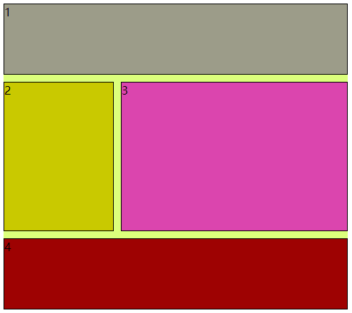
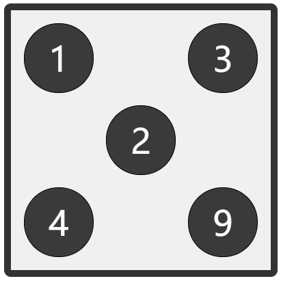
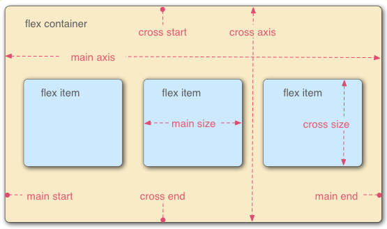
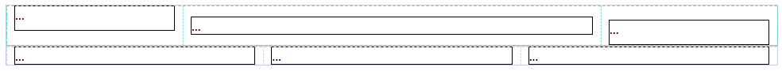

# 网页布局教程

## [CSS Grid 网格布局教程-阮一峰](https://www.ruanyifeng.com/blog/2019/03/grid-layout-tutorial.html)

### 一、概述

网格布局（Grid）是最强大的 CSS 布局方案。

将网页划分成一个个网格，可以任意组合不同的网格，做出各种各样的布局。

Grid 布局与 [Flex 布局](https://www.ruanyifeng.com/blog/2015/07/flex-grammar.html)有一定的相似性，都可以指定容器内部多个项目的位置。

Flex 布局是轴线布局，只能指定"项目"针对轴线的位置，可以看作是**一维布局**。Grid 布局则是将容器划分成"行"和"列"，产生单元格，然后指定"项目所在"的单元格，可以看作是**二维布局**。Grid 布局远比 Flex 布局强大。

### 二、基本概念

#### 2.1 容器和项目

采用网格布局的区域，称为"容器"（container）。容器内部采用网格定位的子元素，称为"项目"（item）。

- 注意：项目只能是容器的顶层子元素，不包含项目的子元素，Grid 布局只对项目生效。

#### 2.2 行和列

容器里面的水平区域称为"行"（row），垂直区域称为"列"（column）。

#### 2.3 单元格

行和列的交叉区域，称为"单元格"（cell）。

#### 2.4 网格线

划分网格的线，称为"网格线"（grid line）。水平网格线划分出行，垂直网格线划分出列。

### 三、容器属性

Grid 布局的属性分成两类。一类定义在容器上面，称为容器属性；另一类定义在项目上面，称为项目属性。

#### 3.1 display 属性

`display: grid` 指定一个容器采用网格布局。

`display: inline-grid;` 默认情况下，容器元素都是块级元素，但也可以设成行内元素。

#### 3.2 grid-template-columns 属性， grid-template-rows 属性

`grid-template-columns`属性定义每一列的列宽，

`grid-template-rows`属性定义每一行的行高。

除了使用绝对单位，也可以使用百分比。

```css
/* 3*3的网格 */
.container {
  display: grid;
  grid-template-columns: 100px 100px 100px;
  /* grid-template-columns: 33.33% 33.33% 33.33%; */
  grid-template-rows: 100px 100px 100px;
}
```

##### （1）repeat()

重复写同样的值非常麻烦，`repeat()`函数，简化重复的值。

`repeat()`接受两个参数，第一个参数是重复的次数（上例是 3），第二个参数是所要重复的值。

```css
.container {
  display: grid;
  grid-template-columns: repeat(3, 33.33%);
  grid-template-rows: repeat(3, 33.33%);
}
```

`repeat()`重复某种模式也是可以的。

```css
grid-template-columns: repeat(2, 100px 20px 80px);
```

##### （2）auto-fill 关键字

有时，单元格的大小是固定的，但是容器的大小不确定。如果希望每一行（或每一列）容纳尽可能多的单元格，这时可以使用`auto-fill`关键字表示自动填充。

每列宽度`100px`，然后自动填充，直到容器不能放置更多的列。

```css
grid-template-columns: repeat(auto-fill, 100px);
```

##### （3）fr 关键字

`fr`（fraction ）关键字表示比例关系。

如果两列的宽度分别为`1fr`和`2fr`，就表示后者是前者的两倍。

```css
grid-template-columns: 1fr 1fr;
```

`fr`可以与绝对长度的单位结合使用。绝对单位不参与比较。

```css
grid-template-columns: 150px 1fr 2fr;
/* 第一列的宽度为150像素，第二列的宽度是第三列的一半。 */
```

##### （4）minmax()

`minmax()`函数产生一个长度范围，表示长度就在这个范围之中。它接受两个参数，分别为最小值和最大值。

```css
grid-template-columns: 1fr 1fr minmax(100px, 1fr);
```

`minmax(100px, 1fr)`表示列宽不小于`100px`，不大于`1fr`。

##### （5）auto 关键字

`auto`关键字表示由浏览器自己决定长度。

```css
grid-template-columns: 100px auto 100px;
```

上面代码中，第二列的宽度，基本上等于该列单元格的最大宽度，除非单元格内容设置了`min-width`，且这个值大于最大宽度。

##### （6）网格线的名称

`grid-template-columns`属性和`grid-template-rows`属性里面，还可以使用方括号指定每一根网格线的名字，方便以后的引用。

```css
.container {
  display: grid;
  grid-template-columns: [c1] 100px [c2] 100px [c3] auto [c4];
  grid-template-rows: [r1] 100px [r2] 100px [r3] auto [r4 fourth];
}
```

网格布局允许同一根线有多个名字，比如`[fifth-line row-5]`。

##### （7）布局实例

`grid-template-columns`属性对于网页布局非常有用。两栏式布局只需要一行代码。

两栏式布局只需要一行代码。

```css
.wrapper {
  display: grid;
  grid-template-columns: 70% 30%;
}
```

传统的十二网格布局，写起来也很容易。

```css
grid-template-columns: repeat(12, 1fr);
```

#### 3.3 grid-row-gap 属性， grid-column-gap 属性， grid-gap 属性

`grid-row-gap`属性设置行与行的间隔（行间距），

`grid-column-gap`属性设置列与列的间隔（列间距）。

Property is obsolete. Avoid using it.

从以基线定位的角度来说，间距就像一条很宽的基线。

```css
grid-column-gap: 10px;
grid-row-gap: 10px;
```

审查元素，点击 grid 标识，显示虚拟框。


`grid-gap`属性是`grid-column-gap`和`grid-row-gap`的合并简写形式:

```css
grid-gap: 20px 20px;
```

如果`grid-gap`省略了第二个值，浏览器认为第二个值等于第一个值。

#### 3.4 grid-template-areas 属性

网格布局允许指定"区域"（area），一个区域由单个或多个单元格组成。`grid-template-areas`属性用于定义区域。

```css
.container {
  display: grid;
  grid-template-columns: 100px 100px 100px;
  grid-template-rows: 100px 100px 100px;
  grid-template-areas:
    'a b c'
    'd e f'
    'g h i';
}
```

上面代码先划分出 9 个单元格，然后将其定名为`a`到`i`的九个区域，分别对应这九个单元格。

多个单元格合并成一个区域的写法如下。

```css
grid-template-areas:
  'a a a'
  'b b b'
  'c c c';
```

上面代码将 9 个单元格分成`a`、`b`、`c`三个区域。

如果某些区域不需要利用，则使用"点"（`.`）表示。

```css
grid-template-areas:
  'a . c'
  'd . f'
  'g . i';
```

上面代码中，中间一列为点，表示没有用到该单元格，或者该单元格不属于任何区域。

示例：



```html
<!DOCTYPE html>
<html lang="en">
  <head>
    <meta charset="UTF-8" />
    <meta http-equiv="X-UA-Compatible" content="IE=edge" />
    <meta name="viewport" content="width=device-width, initial-scale=1.0" />
    <title>Document</title>
    <style>
      #container {
        background-color: rgb(220, 255, 124);
        display: grid;
        grid-template-columns: repeat(3, 1fr);
        grid-template-rows: repeat(4, 100px);
        grid-column-gap: 10px;
        grid-row-gap: 10px;
        grid-template-areas:
          'a a a'
          'b c c'
          'b c c'
          'd d d';
      }
      .item {
        background-color: bisque;
        border: 1px solid rgb(0, 0, 0);
      }
      .a {
        grid-area: a;
        background-color: rgb(156, 156, 137);
      }
      .b {
        grid-area: b;
        background-color: rgb(201, 201, 0);
      }
      .c {
        grid-area: c;
        background-color: rgb(219, 69, 174);
      }
      .d {
        grid-area: d;
        background-color: rgb(158, 2, 2);
      }
    </style>
  </head>
  <body>
    <div id="container">
      <div class="item a">1</div>
      <div class="item b">2</div>
      <div class="item c">3</div>
      <div class="item d">4</div>
      <!-- <div class="item">5</div>
      <div class="item">6</div>
      <div class="item">7</div>
      <div class="item">8</div>
      <div class="item">9</div-->
    </div>
    <!-- <span>2</span-->
  </body>
</html>
```

#### 3.5 grid-auto-flow 属性

划分网格以后，容器的子元素会按照顺序，自动放置在每一个网格。默认的放置顺序是"先行后列"，即先填满第一行，再开始放入第二行，即下图数字的顺序。

这个顺序由`grid-auto-flow`属性决定，默认值是`row`，即"先行后列"。也可以将它设成`column`，变成"**先列后行**"。

```css
grid-auto-flow: column;
```

`grid-auto-flow`属性除了设置成`row`和`column`，

还可以设成`row dense`和`column dense`。

这两个值主要用于，某些项目指定位置以后，剩下的项目怎么自动放置。

"先列后行"，尽量填满空格。

#### 3.6 justify-items 属性， align-items 属性， place-items 属性

`justify-items` 属性设置单元格内容的水平位置（左中右），

`align-items ` 属性设置单元格内容的垂直位置（上中下）。

```css
.container {
  justify-items: start | end | center | stretch;
  align-items: start | end | center | stretch;
}
```

这两个属性的写法完全相同，都可以取下面这些值。

- start：对齐单元格的起始边缘。
- end：对齐单元格的结束边缘。
- center：单元格内部居中。
- stretch：拉伸，占满单元格的整个宽度（默认值）。

`place-items` 属性是`align-items`属性和`justify-items`属性的合并简写形式。

```css
place-items: <align-items<justify-items>;

place-items: start end;
```

#### 3.7 justify-content 属性， align-content 属性， place-content 属性

`justify-content`属性是整个内容区域在容器里面的水平位置（左中右），

`align-content`属性是整个内容区域的垂直位置（上中下）。

```css
.container {
  justify-content: start | end | center | stretch | space-around | space-between | space-evenly;
  align-content: start | end | center | stretch | space-around | space-between | space-evenly;
}
```

```css
start - 对齐容器的起始边框。
end - 对齐容器的结束边框。
center - 容器内部居中。
stretch - 项目大小没有指定时，拉伸占据整个网格容器。
space-around - 每个项目两侧的间隔相等。所以，项目之间的间隔比项目与容器边框的间隔大一倍。
space-between - 项目与项目的间隔相等，项目与容器边框之间没有间隔。
space-evenly - 项目与项目的间隔相等，项目与容器边框之间也是同样长度的间隔。
```

`place-content`属性是`align-content`属性和`justify-content`属性的合并简写形式。

```css
place-content: <align-content<justify-content>;
```

下面是一个例子。

```css
place-content: space-around space-evenly;
```

如果省略第二个值，浏览器就会假定第二个值等于第一个值。

#### 3.8 grid-auto-columns 属性， grid-auto-rows 属性

有时候，一些项目的指定位置，在现有网格的外部。比如网格只有 3 列，但是某一个项目指定在第 5 行。这时，浏览器会自动生成多余的网格，以便放置项目。

`grid-auto-columns`属性和`grid-auto-rows`属性用来设置，浏览器自动创建的多余网格的列宽和行高。

它们的写法与`grid-template-columns`和`grid-template-rows`完全相同。

如果不指定这两个属性，浏览器完全根据单元格内容的大小，决定新增网格的列宽和行高。

#### 3.9 grid-template 属性， grid 属性

`grid-template` 属性是`grid-template-columns`、`grid-template-rows`和`grid-template-areas`这三个属性的合并简写形式。

`grid` 属性是`grid-template-rows`、`grid-template-columns`、`grid-template-areas`、 `grid-auto-rows`、`grid-auto-columns`、`grid-auto-flow`这六个属性的合并简写形式。

从易读易写的角度考虑，还是建议不要合并属性。

### 四、项目属性

#### 4.1 grid-column-start 属性， grid-column-end 属性， grid-row-start 属性， grid-row-end 属性

项目的位置是可以指定的，具体方法就是指定项目的四个边框，分别定位在哪根网格线。

```css
grid-column-start属性：左边框所在的垂直网格线
grid-column-end属性：右边框所在的垂直网格线
grid-row-start属性：上边框所在的水平网格线
grid-row-end属性：下边框所在的水平网格线
```

只指定项目的左右边框，没有指定上下边框，会采用默认位置，即上边框是第一根水平网格线，下边框是第二根水平网格线。

这四个属性的值，除了指定为第几个网格线，还可以指定为网格线的名字。

```css
.item-1 {
  grid-column-start: header-start;
  grid-column-end: header-end;
}
```

这四个属性的值还可以使用`span`关键字，表示"跨越"，即左右边框（上下边框）之间跨越多少个网格。

```css
.item-1 {
  grid-column-start: span 2;
}
```

使用这四个属性，如果产生了项目的重叠，则使用`z-index`属性指定项目的重叠顺序。

#### 4.2 grid-column 属性， grid-row 属性

`grid-column`属性是`grid-column-start`和`grid-column-end`的合并简写形式，

`grid-row`属性是`grid-row-start`属性和`grid-row-end`的合并简写形式。

```css
.item {
  grid-column: <start-line/ <end-line>;
  grid-row: <start-line/ <end-line>;
}
```

这两个属性之中，也可以使用`span`关键字，表示跨越多少个网格。

```css
.item-1 {
  background: #b03532;
  grid-column: 1 / 3;
  grid-row: 1 / 3;
}
/* 等同于 */
.item-1 {
  background: #b03532;
  grid-column: 1 / span 2;
  grid-row: 1 / span 2;
}
```

斜杠以及后面的部分可以省略，默认跨越一个网格。

```css
.item-1 {
  grid-column: 1;
  grid-row: 1;
}
```

#### 4.3 grid-area 属性

`grid-area`属性指定项目放在哪一个区域。

配合 `grid-template-areas:` 使用，

```css
#cantainer {
  grid-template-areas:
    'a a a'
    'b . c'
    'b . c'
    'd d d';
}
.item-1 {
  grid-area: d;
}
```

`grid-area`属性还可用作`grid-row-start`、`grid-column-start`、`grid-row-end`、`grid-column-end`的合并简写形式，直接指定项目的位置。

```css
.item {
  grid-area: <row-start/ <column-start/ <row-end/ <column-end>;
}

.item-1 {
  grid-area: 1 / 1 / 3 / 3;
}
```

#### 4.4 justify-self 属性， align-self 属性， place-self 属性

`justify-self`属性设置单元格内容的水平位置（左中右），跟`justify-items`属性的用法完全一致，但只作用于单个项目。

`align-self`属性设置单元格内容的垂直位置（上中下），跟`align-items`属性的用法完全一致，也是只作用于单个项目。

```css
.item {
  justify-self: start | end | center | stretch;
  align-self: start | end | center | stretch;
}
```

这两个属性都可以取下面四个值。

- start：对齐单元格的起始边缘。
- end：对齐单元格的结束边缘。
- center：单元格内部居中。
- stretch：拉伸，占满单元格的整个宽度（默认值）。

`place-self`属性是`align-self`属性和`justify-self`属性的合并简写形式。

```css
place-self: <align-self> <justify-self>;
```

如果省略第二个值，`place-self`属性会认为这两个值相等。

### 五、画骰子 🎲



```html
<!DOCTYPE html>
<html lang="en">
  <head>
    <meta charset="UTF-8" />
    <meta http-equiv="X-UA-Compatible" content="IE=edge" />
    <meta name="viewport" content="width=device-width, initial-scale=1.0" />
    <title>Document</title>
    <style>
      #container {
        background-color: rgb(240, 240, 240);
        border-radius: 10px;
        border: 10px solid #333;
        display: grid;
        width: 380px;
        height: 380px;
        grid-template-columns: repeat(3, 120px);
        grid-template-rows: repeat(3, 120px);
        grid-auto-rows: 120px;
        align-items: center;
        justify-items: center;
        align-content: center;
        justify-content: center;
      }
      .item {
        background-color: rgb(58, 58, 58);
        border: 1px solid rgb(0, 0, 0);
        height: 100px;
        width: 100px;
        border-radius: 50px;
        text-align: center;
        line-height: 100px;
        color: #fff;
        font-size: 50px;
      }
      .one {
        grid-area: 2 / 2 / 3 / 3;
      }
      .two {
        grid-area: 3 / 3 / 4 / 4;
      }
      .three {
        grid-area: 3 / 3 / 4 / 4;
      }
      .fiveR {
        grid-area: 1 / 3 / 2 / 4;
      }
      .fiveL {
        grid-area: 3 / 1 / 4 / 2;
      }
    </style>
  </head>
  <body>
    <div id="container">
      <div class="item"><div class="content">1</div></div>
      <div class="item one">2</div>
      <div class="item fiveR">3</div>
      <div class="item fiveL">4</div>
      <!-- <div class="item">5</div>
      <div class="item">6</div>
      <div class="item">7</div>
      <div class="item">8</div> -->
      <div class="item two">9</div>
    </div>
  </body>
</html>
```

## [Flex 布局教程：语法篇](https://www.ruanyifeng.com/blog/2015/07/flex-grammar.html)

布局的传统解决方案，基于[盒状模型](https://developer.mozilla.org/en-US/docs/Web/CSS/box_model)，依赖 [`display`](https://developer.mozilla.org/en-US/docs/Web/CSS/display) 属性 + [`position`](https://developer.mozilla.org/en-US/docs/Web/CSS/position)属性 + [`float`](https://developer.mozilla.org/en-US/docs/Web/CSS/float)属性。它对于那些特殊布局非常不方便，比如，[垂直居中](https://css-tricks.com/centering-css-complete-guide/)就不容易实现。

Flex 布局，它已经得到了所有浏览器的支持。

[Basic_Concepts_of_Flexbox](https://developer.mozilla.org/zh-CN/docs/Web/CSS/CSS_Flexible_Box_Layout/Basic_Concepts_of_Flexbox)

### 一、Flex 布局是什么？

Flex 是 Flexible Box 的缩写，意为"弹性布局"，用来为盒状模型提供最大的灵活性。

任何一个容器都可以指定为 Flex 布局。

行内元素也可以使用 Flex 布局。

Webkit 内核的浏览器，必须加上`-webkit`前缀。

```css
.box {
  display: -webkit-flex; /* Safari */
  display: flex;
}
```

注意，设为 Flex 布局以后，子元素的`float`、`clear`和`vertical-align`属性将失效。

> **`vertical-align`** 用来指定行内元素（inline）或表格单元格（table-cell）元素的垂直对齐方式。
>
> `vertical-align` 只对行内元素、表格单元格元素生效：不能用它垂直对齐[块级元素](https://developer.mozilla.org/zh-CN/docs/Web/HTML/Block-level_elements)。

### 二、基本概念

采用 Flex 布局的元素，称为 Flex 容器（flex container），简称"容器"。它的所有子元素自动成为容器成员，称为 Flex 项目（flex item），简称"项目"。



容器默认存在两根轴：**水平的主轴（main axis）**和**垂直的交叉轴（cross axis）**。

- 主轴的开始位置（与边框的交叉点）叫做`main start`，
  - 结束位置叫做`main end`；
- 交叉轴的开始位置叫做`cross start`，
  - 结束位置叫做`cross end`。

项目默认沿主轴排列。

- 单个项目占据的主轴空间叫做`main size`，
- 占据的交叉轴空间叫做`cross size`。

### 三、容器的属性

以下 6 个属性设置在容器上。

- `flex-direction`
- `flex-wrap`
- `flex-flow`
- `justify-content`
- `align-items`
- `align-content`

所有 CSS 属性都会有一个初始值，所以 flex 容器中的所有 flex 元素都会有下列行为：

- 元素排列为一行 (`flex-direction` 属性的初始值是 `row`)。
- 元素从主轴的起始线开始。
- 元素不会在主维度方向拉伸，但是可以缩小。
- 元素被拉伸来填充交叉轴大小。
- [`flex-basis`](https://developer.mozilla.org/zh-CN/docs/Web/CSS/flex-basis) 属性为 `auto`。
- [`flex-wrap`](https://developer.mozilla.org/zh-CN/docs/Web/CSS/flex-wrap) 属性为 `nowrap`。

这会让你的元素呈线形排列，并且把自己的大小作为主轴上的大小。如果有太多元素超出容器，它们会溢出而不会换行。如果一些元素比其他元素高，那么元素会沿交叉轴被拉伸来填满它的大小。

#### 3.1 flex-direction 属性

`flex-direction` 属性决定主轴的方向（即项目的排列方向）。

```css
.box {
  flex-direction: row | row-reverse | column | column-reverse;
}

row（默认值）：主轴为水平方向，起点在左端。
row-reverse：主轴为水平方向，起点在右端。
column：主轴为垂直方向，起点在上沿。
column-reverse：主轴为垂直方向，起点在下沿。
```

交叉轴垂直于主轴，所以如果你的`flex-direction` (主轴) 设成了 `row` 或者 `row-reverse` 的话，交叉轴的方向就是沿着列向下的。

如果主轴方向设成了 `column` 或者 `column-reverse`，交叉轴就是水平方向。

理解主轴和交叉轴的概念对于对齐 flexbox 里面的元素是很重要的；flexbox 的特性是沿着主轴或者交叉轴对齐之中的元素。

#### 3.2 flex-wrap 属性

默认情况下，项目都排在一条线（又称"轴线"）上。

`flex-wrap`属性定义，如果一条轴线排不下，如何换行。

```css
.box{
  flex-wrap: nowrap | wrap | wrap-reverse;
}

nowrap（默认）：不换行。
wrap：换行，第一行在上方。
wrap-reverse：换行，第一行在下方。
```

#### 3.3 flex-flow

`flex-flow`属性是`flex-direction`属性和`flex-wrap`属性的简写形式，默认值为`row nowrap`。

```css
.box {
  flex-flow: <flex-direction> || <flex-wrap>;
}
```

#### 3.4 justify-content 属性

`justify-content`属性定义了项目在主轴上的对齐方式。

```css
.box {
  justify-content: flex-start | flex-end | center | space-between | space-around;
}

能取5个值，具体对齐方式与轴的方向有关。下面假设主轴为从左到右。

flex-start（默认值）：左对齐
flex-end：右对齐
center： 居中
space-between：两端对齐，项目之间的间隔都相等。
space-around：每个项目两侧的间隔相等。所以，项目之间的间隔比项目与边框的间隔大一倍。
space-evenly：所有间隔相等。
```

#### 3.5 align-items 属性

`align-items`属性定义项目在交叉轴上如何对齐。

```css
.box {
  align-items: flex-start | flex-end | center | baseline | stretch;
}

能取5个值。具体的对齐方式与交叉轴的方向有关，下面假设交叉轴从上到下。

flex-start：交叉轴的起点对齐。
flex-end：交叉轴的终点对齐。
center：交叉轴的中点对齐。
baseline: 项目的第一行文字的基线对齐。
stretch（默认值）：如果项目未设置高度或设为auto，将占满整个容器的高度。
```

#### 3.6 align-content 属性

`align-content`属性定义了多根轴线的对齐方式。

如果项目只有一根轴线，该属性不起作用。

在交叉轴方向上有多行时，align-content 属性能作用。

多个轴线既：一个容器内多个 flex 容器。

纵向分布

```css
.box {
  align-content: flex-start | flex-end | center | space-between | space-around | stretch;
}

flex-start：与交叉轴的起点对齐。
flex-end：与交叉轴的终点对齐。
center：与交叉轴的中点对齐。
space-between：与交叉轴两端对齐，轴线之间的间隔平均分布。
space-around：每根轴线两侧的间隔都相等。所以，轴线之间的间隔比轴线与边框的间隔大一倍。
stretch（默认值）：轴线占满整个交叉轴。
```

### 四、项目的属性

以下 6 个属性设置在项目上。

- `order`
- `flex-grow`
- `flex-shrink`
- `flex-basis`
- `flex`
- `align-self`

#### 4.1 order 属性

`order`属性定义项目的排列顺序。

数值越小，排列越靠前，默认为 0。

```css
.item {
  order: <integer>;
}
```

#### 4.2 flex-grow 属性

`flex-grow`属性定义项目的放大比例，默认为`0`，即如果存在剩余空间，也不放大。

```css
.item {
  flex-grow: <number>; /* default 0 */
}
```

如果所有项目的`flex-grow`属性都为 1，则它们将等分剩余空间（如果有的话）。

如果一个项目的`flex-grow`属性为 2，其他项目都为 1，则前者占据的剩余空间将比其他项多一倍。

#### 4.3 flex-shrink 属性

`flex-shrink`属性定义了项目的缩小比例，默认为 1，即如果空间不足，该项目将缩小。

```css
.item {
  flex-shrink: <number>; /* default 1 */
}
```

如果所有项目的`flex-shrink`属性都为 1，当空间不足时，都将等比例缩小。

如果一个项目的`flex-shrink`属性为 0，其他项目都为 1，则空间不足时，前者不缩小。

负值对该属性无效。

#### 4.4 flex-basis 属性

`flex-basis`属性定义了在分配多余空间之前，项目占据的主轴空间（main size）。

浏览器根据这个属性，计算主轴是否有多余空间。

它的默认值为`auto`，即项目的本来大小。

```css
.item {
  flex-basis: <length> | auto; /* default auto */
}
```

它可以设为跟`width`或`height`属性一样的值（比如 350px），则项目将占据固定空间。

#### 4.5 flex 属性

`flex`属性是`flex-grow`, `flex-shrink` 和 `flex-basis`的简写，默认值为`0 1 auto`。后两个属性可选。

放大，缩小，大小

```css
.item {
  flex: none | [ < 'flex-grow' > < 'flex-shrink' >? || < 'flex-basis' > ];
}
```

该属性有两个快捷值：`auto` (`1 1 auto`) 和 none (`0 0 auto`)。

建议优先使用这个属性，而不是单独写三个分离的属性，因为浏览器会推算相关值。

#### 4.6 align-self 属性

`align-self`属性允许单个项目有与其他项目不一样的对齐方式，可覆盖`align-items`属性。

默认值为`auto`，表示继承父元素的`align-items`属性，如果没有父元素，则等同于`stretch`。

```css
.item {
  align-self: auto | flex-start | flex-end | center | baseline | stretch;
}
```

该属性可能取 6 个值，除了`auto`，其他都与`align-items`属性完全一致。

## [Flex 布局教程：实例篇](https://www.ruanyifeng.com/blog/2015/07/flex-examples.html)

### 一、画骰子 🎲

```html
<!DOCTYPE html>
<html lang="en">
  <head>
    <meta charset="UTF-8" />
    <meta http-equiv="X-UA-Compatible" content="IE=edge" />
    <meta name="viewport" content="width=device-width, initial-scale=1.0" />
    <title>Document</title>
    <style>
      .box {
        display: flex;
        flex-wrap: wrap;
        width: 380px;
        height: 380px;
        border-radius: 10px;
        border: rgb(133, 133, 133) 10px solid;
      }
      .item {
        width: 100px;
        height: 100px;
        background-color: rgb(0, 0, 0);
        border: 10px solid rgb(255, 255, 255);
        border-radius: 60px;
        color: #fff;
        text-align: center;
        line-height: 100px;
        font-size: 50px;
      }
      .b1 {
        /* align-items: flex-start; */
        /* flex-flow: row wrap; */
        align-items: flex-end;
        justify-content: flex-end;
      }
      /* a
           
             a
      */
      .b2 {
        justify-content: space-between;
        /* align-items: flex-end; */
      }
      .b2 > .item:nth-child(2) {
        align-self: flex-end;
      }
      /* a  
           a
             a
      */
      .b3 {
        justify-content: space-between;
        /* align-items: flex-end; */
      }
      .b3 > .item:nth-child(2) {
        align-self: center;
      }
      .b3 > .item:nth-child(3) {
        align-self: flex-end;
      }
      /* a a a
           
         a a a
      */
      .b6 {
        justify-content: space-between;
        align-content: space-between;
        /* flex-direction: column; */
      }
      /* a a a
           a
         a   a
      */
      .row {
        flex-basis: 100%;
        display: flex;
        justify-content: space-between;
      }
      .b7 > .row:nth-child(2) {
        justify-content: center;
      }
      .b7 > .row:nth-child(3) {
        justify-content: space-between;
      }
    </style>
  </head>
  <body>
    <div class="box b1">
      <div class="item a1-1">1</div>
    </div>
    <div class="box b2">
      <div class="item">1</div>
      <div class="item">2</div>
    </div>
    <div class="box b3">
      <div class="item">1</div>
      <div class="item">2</div>
      <div class="item">3</div>
    </div>
    <div class="box b6">
      <div class="item">1</div>
      <div class="item">2</div>
      <div class="item">3</div>
      <div class="item">4</div>
      <div class="item">5</div>
      <div class="item">6</div>
    </div>
    <div class="box b7">
      <div class="row">
        <div class="item">1</div>
        <div class="item">2</div>
        <div class="item">3</div>
      </div>
      <div class="row">
        <div class="item">4</div>
      </div>
      <div class="row">
        <div class="item">5</div>
        <div class="item">6</div>
      </div>
    </div>
  </body>
</html>
```

### 二、网格布局



```html
<!DOCTYPE html>
<html lang="en">
  <head>
    <meta charset="UTF-8" />
    <meta http-equiv="X-UA-Compatible" content="IE=edge" />
    <meta name="viewport" content="width=device-width, initial-scale=1.0" />
    <title>Document</title>
    <style>
      .Flex {
        display: flex;
        height: 50px;
        align-items: center;
        border: rgb(202, 202, 202) 1px solid;
      }
      .Flex-cell {
        border: 1px #000 solid;
        margin: 0 10px 0 10px;
      }
      .Flex > .Flex-cell:first-child {
        height: 30px;
        flex: 0 0 200px;
        align-self: flex-start;
      }
      .Flex > .Flex-cell:nth-child(2) {
        /* 放大，缩小，大小 */
        flex: 1 0 200px;
      }
      .Flex > .Flex-cell:last-child {
        height: 30px;
        flex: 0 0 200px;
        align-self: flex-end;
      }
      /* 第二行 */
      .Flex-P {
        display: flex;
        flex-wrap: wrap;
        border: rgb(206, 206, 206) 1px solid;
      }
      .Flex-P-cell {
        border: 1px #000 solid;
        margin: 0 10px 0 10px;
        flex: 1 0 300px;
      }
    </style>
  </head>
  <body>
    <div class="Flex">
      <div class="Flex-cell">...</div>
      <div class="Flex-cell">...</div>
      <div class="Flex-cell">...</div>
    </div>
    <div class="Flex-P">
      <div class="Flex-P-cell">...</div>
      <div class="Flex-P-cell">...</div>
      <div class="Flex-P-cell">...</div>
    </div>
  </body>
</html>
```

### 三、圣杯布局+媒体查询

```html
<!DOCTYPE html>
<html lang="en">
  <head>
    <meta charset="UTF-8" />
    <meta http-equiv="X-UA-Compatible" content="IE=edge" />
    <meta name="viewport" content="width=device-width, initial-scale=1.0" />
    <title>Document</title>
    <style>
      body {
        margin: 0;
        padding: 0;
      }
      header {
        width: 100%;
        background-color: burlywood;
        height: 50px;
      }
      footer {
        width: 100%;
        background-color: rgb(87, 84, 83);
        height: 50px;
      }
      section {
        display: flex;
        height: 200px;
      }
      nav {
        flex: 0 0 200px;
        background-color: lightblue;
        order: -1;
      }
      main {
        flex: 1 0 400px;
        background-color: rgb(232, 255, 170);
      }
      aside {
        flex: 0 1 200px;
        background-color: rgb(88, 92, 146);
      }

      /* 如果是小屏幕，躯干的三栏自动变为垂直叠加。 */
      @media (max-width: 768px) {
        section {
          display: flex;
          flex-direction: column;
        }
        nav,
        main,
        aside {
          flex: auto;
        }

        .HolyGrail-body {
          flex-direction: column;
          flex: 1;
        }
        .HolyGrail-nav,
        .HolyGrail-ads,
        .HolyGrail-content {
          flex: auto;
        }
      }
      .HolyGrail {
        display: flex;
        min-height: 100vh;
        flex-direction: column;
      }

      header,
      footer {
        flex: 1;
      }

      .HolyGrail-body {
        display: flex;
        flex: 1;
      }

      .HolyGrail-content {
        flex: 1;
      }

      .HolyGrail-nav,
      .HolyGrail-ads {
        /* 两个边栏的宽度设为12em */
        flex: 0 0 12em;
      }

      .HolyGrail-nav {
        /* 导航放到最左边 */
        order: -1;
      }
    </style>
  </head>
  <body>
    <header>header</header>
    <section>
      <main>main</main>
      <nav>nav</nav>
      <aside>aside</aside>
    </section>
    <footer>footer</footer>
    <br />
    <div class="HolyGrail">
      <header>layout two</header>
      <div class="HolyGrail-body">
        <main class="HolyGrail-content">...</main>
        <nav class="HolyGrail-nav">...</nav>
        <aside class="HolyGrail-ads">...</aside>
      </div>
      <footer>...</footer>
    </div>
  </body>
</html>
```

#### 圣杯布局margin版：

```html
<!DOCTYPE html>
<html>
<head>
    <meta charset="UTF-8">
    <meta name="viewport" content="width=device-width, initial-scale=1.0">
    <meta http-equiv="X-UA-Compatible" content="ie=edge">
    <title>圣杯布局</title>
    <style type="text/css">
        body {
            min-width: 550px;
        }
        #header {
            text-align: center;
            background-color: #f1f1f1;
        }

        #container {
            padding-left: 200px;
            padding-right: 150px;
        }
        #container .column {
            float: left;
        }

        #center {
            background-color: #ccc;
            width: 100%;
        }
        #left {
            position: relative;
            background-color: yellow;
            width: 200px;
            margin-left: -100%;
            right: 200px;
        }
        #right {
            background-color: red;
            width: 150px;
            margin-right: -150px;
        }

        #footer {
            text-align: center;
            background-color: #f1f1f1;
        }

        /* 手写 clearfix */
        .clearfix:after {
            content: '';
            display: table;
            clear: both;
        }
    </style>
</head>
<body>
    <div id="header">this is header</div>
    <div id="container" class="clearfix">
        <div id="center" class="column">this is center</div>
        <div id="left" class="column">this is left</div>
        <div id="right" class="column">this is right</div>
    </div>
    <div id="footer">this is footer</div>
</body>
</html>
```

### 四、双飞翼布局

```html
<!DOCTYPE html>
<html lang="en">
  <head>
    <meta charset="UTF-8" />
    <meta http-equiv="X-UA-Compatible" content="IE=edge" />
    <meta name="viewport" content="width=device-width, initial-scale=1.0" />
    <title>Document</title>
    <style>
      body {
        min-width: 600px;
        margin: 0;
        padding: 0;
      }
      .double main {
        width: 100%;
        float: left;
        min-height: 100px;
      }
      .mainWrap {
        background-color: rgb(232, 255, 170);
        margin-left: 200px;
        margin-right: 200px;
      }
      .double nav {
        background-color: lightblue;
        width: 200px;
        min-height: 100px;
        float: left;
        margin-left: -100%;
      }
      .double aside {
        background-color: rgb(88, 92, 146);
        width: 200px;
        float: right;
        min-height: 100px;
        margin-left: -200px;
      }
      .clearFix::after {
        content: '';
        display: table;
        clear: both;
      }
    </style>
  </head>
  <body>
    <header>head</header>
    <div class="double clearFix">
      <main>
        <div class="mainWrap">
          main main main main main main main main main main main main main main main main main main main main main main
          main main main main main main main main main main main main main main main main main
        </div>
      </main>
      <nav>nav</nav>
      <aside>aside</aside>
    </div>
    <footer>footer</footer>
  </body>
</html>
```

## [Grid and flexbox-MDN](https://developer.mozilla.org/zh-CN/docs/Web/CSS/CSS_Grid_Layout/Relationship_of_Grid_Layout#grid_and_flexbox)

当抉择该用网格还是弹性盒时，你可以问自己一个简单的问题：

- 我只需要按行或者列控制布局？那就用弹性盒子
- 我需要同时按行和列控制布局？那就用网格

## [使用媒体查询-MDN](https://developer.mozilla.org/zh-CN/docs/Web/CSS/Media_Queries/Using_media_queries)

### [媒体类型](https://developer.mozilla.org/zh-CN/docs/Web/CSS/Media_Queries/Using_media_queries#媒体类型)

媒体类型（Media types）描述设备的一般类别。除非使用 `not` 或 `only` 逻辑操作符，媒体类型是可选的，并且会（隐式地）应用 `all` 类型。

- `all`
  - 适用于所有设备。
- `screen`
  - 主要用于屏幕。

### [逻辑操作符](https://developer.mozilla.org/zh-CN/docs/Web/CSS/Media_Queries/Using_media_queries#逻辑操作符)

逻辑操作符（logical operators） `not`, `and`, 和 `only` 可用于联合构造复杂的媒体查询，您还可以通过用逗号分隔多个媒体查询，将它们组合为一个规则。

- **`and` 操作符** 用于将多个媒体查询规则**组合成单条媒体查询**，当每个查询规则都为真时则该条媒体查询为真，它还用于将媒体功能与媒体类型结合在一起。
- **`not`运算符** 用于否定媒体查询，如果不满足这个条件则返回true，否则返回false。 如果出现在以逗号分隔的查询列表中，它将仅否定应用了该查询的特定查询。 如果使用not运算符，则还必须指定媒体类型。
  - **注意：**在Level 3中，`not`关键字不能用于否定单个媒体功能表达式，而只能用于否定整个媒体查询。
- **`only`运算符** 仅在整个查询匹配时才用于应用样式，并且对于防止较早的浏览器应用所选样式很有用。 
  - 当不使用`only`时，旧版本的浏览器会将`screen and (max-width: 500px)`简单地解释为`screen`，忽略查询的其余部分，并将其样式应用于所有屏幕。 
  - 如果使用`only`运算符，则还必须指定媒体类型。
- **`,` 逗号** 用于将多个媒体查询**合并为一个规则**。 逗号分隔列表中的每个查询都与其他查询**分开处理**。 
  - 因此，如果列表中的任何查询为true，则整个media语句均返回true。 换句话说，列表的行为类似于逻辑或`or`运算符。

### [定位媒体特性](https://developer.mozilla.org/zh-CN/docs/Web/CSS/Media_Queries/Using_media_queries#定位媒体特性)

许多媒体功能都是*范围功能*，这意味着可以在它们前面加上“最小”或“最大”来表示“最小条件”或“最大条件”约束。 

```css
@media (max-width: 12450px) { ... }
```


### 媒体查询实例

单位使用 rem

```css
/* 括号边一定要有空格, only 提高兼容性 */
@media only screen and (max-width: 374px) {
  /* iphone5 或者更小的尺寸，以 iphone5 的宽度（320px）比例设置 font-size */
  html {
    font-size: 86px;
  }
}
@media only screen and (min-width: 375px) and (max-width: 413px) {
  /* iphone6/7/8 和 iphone x */
  html {
    font-size: 100px;
  }
}
@media only screen and (min-width: 414px) {
  /* iphone6p 或者更大的尺寸，以 iphone6p 的宽度（414px）比例设置 font-size */
  html {
    font-size: 110px;
  }
}

body {
  font-size: 0.16rem;
}
#div1 {
  width: 1rem;
  background-color: #ccc;
}
```
